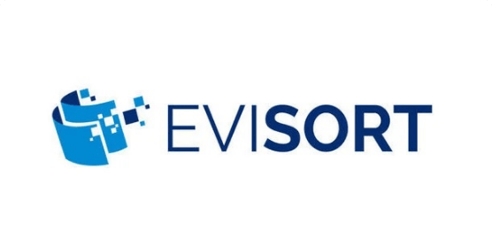
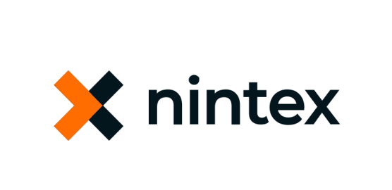

<ResourceCard slots="link, image,text, buttons" width="33%" theme="lightest" isFooter className='useCaseCard  landingResourceCard' isCustomStories/>

[Waymark-Story.pdf](../resources/Waymark-Story.pdf)

See how Evisort uses Adobe PDF Extract API to bring visibility and intelligence to contracts.

* [Read story](../resources/Waymark-Story.pdf)

<ResourceCard slots="link, image, text, buttons" width="33%" theme="lightest" isFooter className='useCaseCard  landingResourceCard' isCustomStories/>

[AdobeInDesign.pdf](../resources/AdobeInDesign.pdf)

See how Nintex transforms K2 Cloud workflows to automate employee access and remote work tracking.

* [Read story](../resources/AdobeInDesign.pdf)

<ResourceCard slots="link, image, text, buttons" width="33%" theme="lightest" isFooter className='useCaseCard  hme-custom-header landingResourceCard' isCustomStories/>

[Cambridge-Assessment.pdf](../resources/Cambridge-Assessment.pdf)

See how Waymark Tech enables rapid impact assessments and compliance workflows with Adobe PDF Extract API.

* [Read story](../resources/Cambridge-Assessment.pdf)
