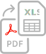

<TitleBlock slots="heading" theme="light" className="titleBlock-align-left accessibility-key-feature-title"/>

## Key features of Adobe PDF Accessibility Auto-Tag API

<TextBlock slots="image, heading, text" width="25%" theme="light" className="align-left iocn-size  horizontal-align-heading Benefits-one"/>

### Highly accurate content tagging

Automatically tag tables, paragraphs, lists, and headings to improve the reading experience of native and scanned PDFs with assistive technologies.

<TextBlock slots="image, heading, text" width="25%" theme="light" className="align-left iocn-size  horizontal-align-heading Benefits-two"/>

### Reading order identification

Identify the logical flow of information, even with multiple columns and elements across multiple pages.

<TextBlock slots="image, heading, text" width="25%" theme="light" className="align-left iocn-size  link horizontal-align-heading linking Benefits-three"/>

### Wide range of doc types, at scale

Apply at scale to large backlogs or add to automated workflows, including long-form text and mixed-content documents across various languages.

<TextBlock slots="image, heading, text" width="25%" theme="light" className="align-left iocn-size  link horizontal-align-heading linking Benefits-four"/>

### Tailored tagging report

Review a generated Microsoft Excel report detailing the tags that were replaced, if any, the newly added tags, and any content that needs additional review.