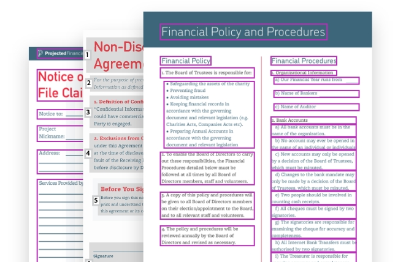
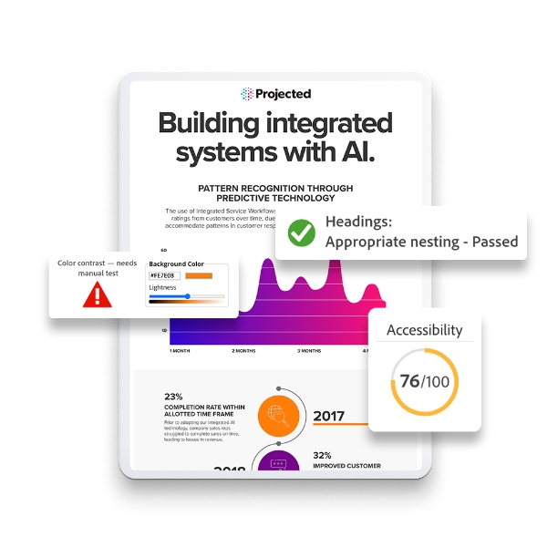

<TextBlock slots="heading,text,image" theme="lightest" headerElementType="h2" variantsTypePrimary='secondary'  isPrimaryBtn homeZigZag className="home-zigzag-comp-padding Adobe-PDF-Services-API ms-zigzag-cta-one zigzag-align zig-zag-cont-one"/>

### Improve PDF accessibility for all users

Improve the user experience for all stakeholders, including employees, customers, citizens, or students who leverage screen readers with accurate auto-tagging - this applies to documents created internally as well as externally or by third parties.

<TextBlock slots="image,heading,text" theme="lightest" headerElementType="h2" variantsTypePrimary='secondary'  isPrimaryBtn homeZigZag className="home-zigzag-comp-padding Adobe-PDF-Services-API ms-zigzag-cta-one zigzag-align zig-zag-cont-two"/>

### Remediate easily at scale

Tagging PDFs can often be slow, manual, and error prone. Make your documents more inclusive at scale and avoid picking and choosing which documents to remediate.

<TextBlock slots="heading,text,image" theme="lightest" headerElementType="h2" variantsTypePrimary='secondary'  isPrimaryBtn homeZigZag className="home-zigzag-comp-padding Adobe-PDF-Services-API ms-zigzag-cta-one zigzag-align zig-zag-cont-three"/>

### Move toward compliance with greater ease

Automation leads to more efficient remediation. Reduce legal risk while lowering the overhead and resources you may need to move toward compliance with certain accessibility standards.

