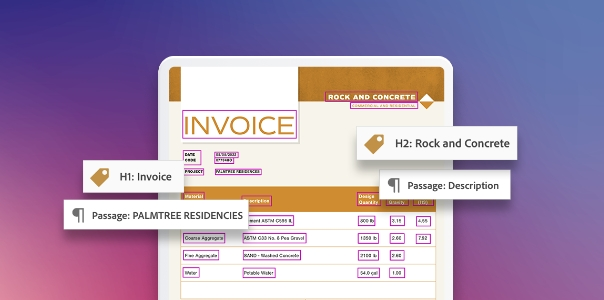
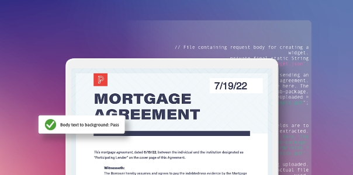
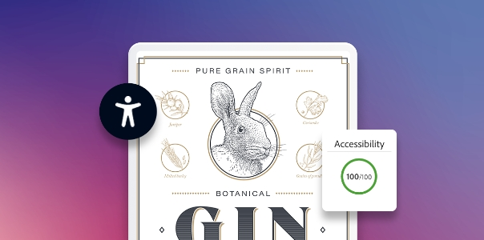

<TitleBlock slots="heading" theme="light" className="titleBlock-align-left accessibility-title"/>

## Learn more about PDF accessibility

<ResourceCard slots="link, image, heading, text" width="25%" theme='light' className="useCaseCard-doc-gen" />

## PDF Accessibility 101

Combining PDF file format accessibility features with Adobe Acrobat and Adobe Reader allow universal access to documents.

<ResourceCard slots="link, image, heading, text" width="25%" theme='light' className="useCaseCard-doc-gen" />

## Creating accessible PDFs

Create accessible PDFs by following the steps outlined in this workflow.

<ResourceCard slots="link, image, heading, text" width="25%" theme='light' className="useCaseCard-doc-gen" />

## Acrobat Accessibility webinar series

Watch our six-part webinar series and follow along using practice files to expand your accessibility knowledge.
