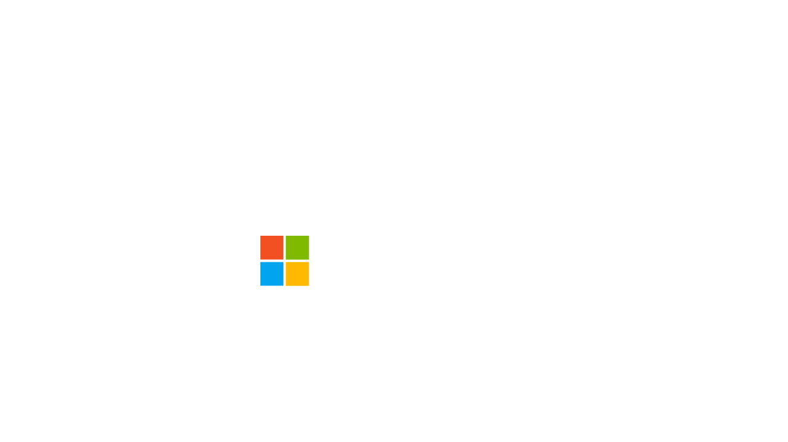
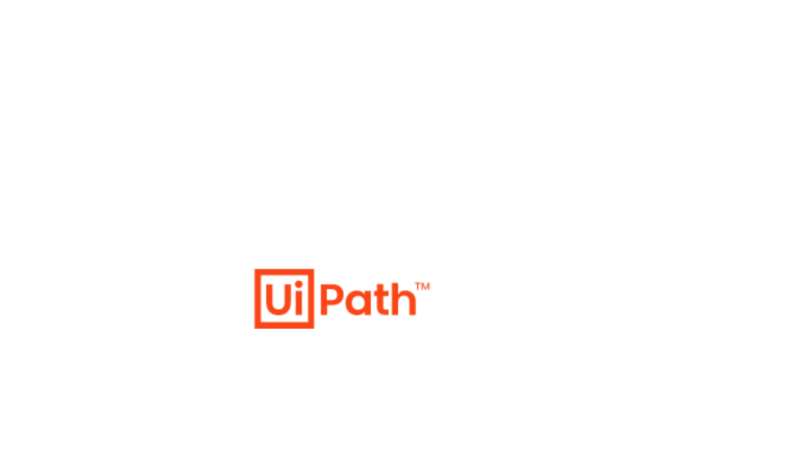

<Carousel slots="bgimage, image, heading, text, buttons" repeat="2"  theme="lightest" enableNavigation slideTheme='dark' className="carousel-padding-top-zero aws-carousel" varient="fullWidth" navigationNext="white-swiper-button" navigationPre="white-swiper-button" isCenter  />

carousel-micosoft

## Available on Microsoft Power Automate

### Automate document generation processes across CRMs, forms, and apps using our PDF Services Connector

- [Learn more](https://helpx.adobe.com/acrobat/web/use-acrobat-extensions/adobe-pdf-services-connector/connect-for-power-automate.html)

carousel-ui-path

## UiPath Integration

### Automate end-to-end digital document processes and workflows easily with UiPath, Adobe Acrobat Services,  and Adobe Acrobat Sign.

- [Learn more](https://marketplace.uipath.com/listings/adobe-pdf-services)
