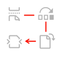

<SummaryBlock slots="heading, buttons" theme="lightest" buttonPositionRight btnVariant="cta" isBtnVariant />

## Why Document Generation API?

* [Product overview video](https://video.tv.adobe.com/v/332120)

<TextBlock slots="image, heading, text" width="33%" theme="lightest" className=" icon-xl-size padding-btm-zero-left-align horizontal-align-heading"/>

### Authoring Tools for Improved Productivity

Use our Adobe Document Generation Tagger Word add-in to quickly build custom branded Microsoft Word or PDF documents with data.

<TextBlock slots="image, heading, text" width="33%" theme="lightest" className=" icon-xl-size padding-btm-zero-left-align horizontal-align-heading"/>

### Manipulate and Merge Dynamic Data

Process text tags, calculations, repeating elements, and conditional statements at runtime.

<TextBlock slots="image, heading, text" width="33%" theme="lightest" className=" icon-xl-size padding-btm-zero-left-align horizontal-align-heading"/>

### Document Generation with Signatures

Adobe Acrobat Sign integration allows you to generate documents with signatures including conditional logic for signature text tags.