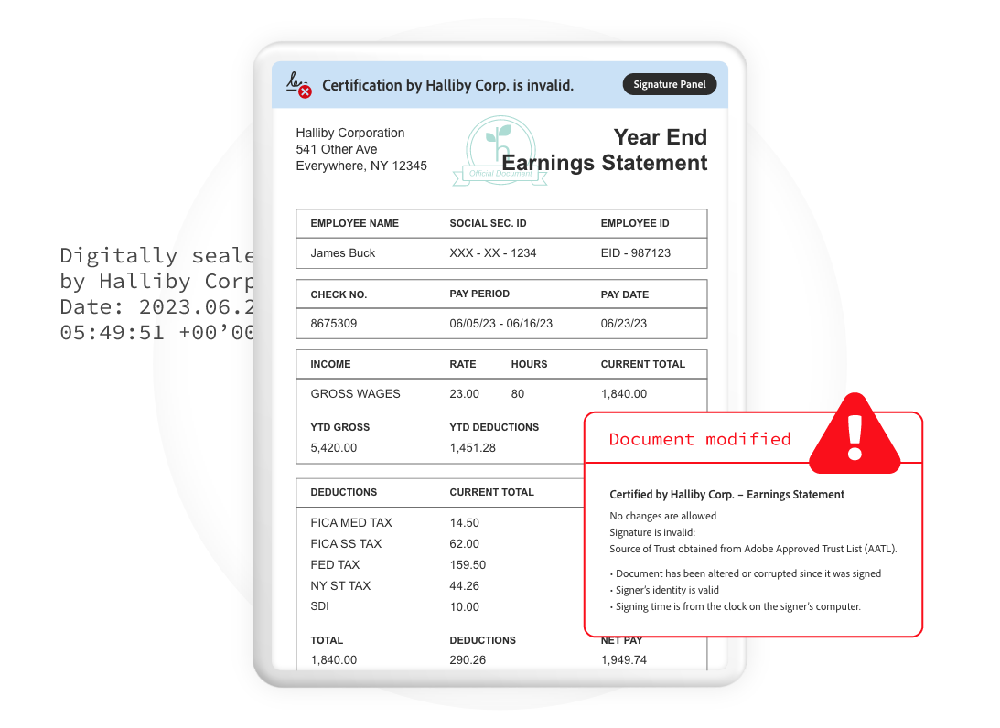
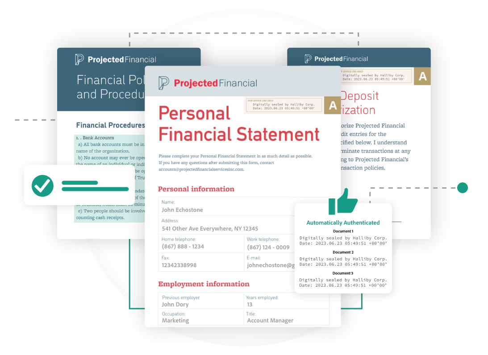
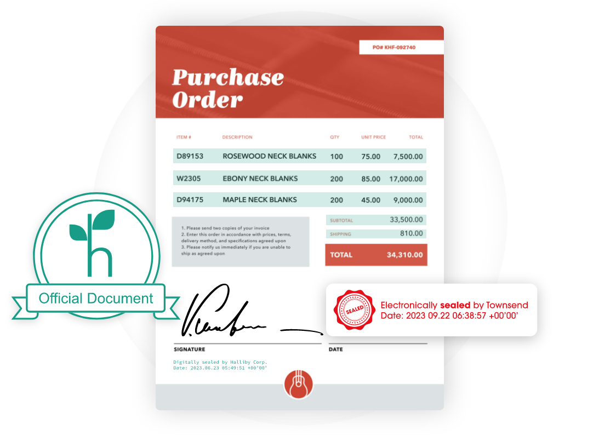

<TextBlock slots="heading,text,image" theme="lightest" headerElementType="h2" variantsTypePrimary='secondary'  isPrimaryBtn homeZigZag className="home-zigzag-comp-padding Adobe-PDF-Services-API ms-zigzag-cta-one zigzag-align zig-zag-cont-one"/>

### Make critical business documents tamper-evident

Detect any tampering made to bills, invoices, employee verification documents, and other critical documents after the e-seal was applied.

<TextBlock slots="image,heading,text" theme="lightest" headerElementType="h2" variantsTypePrimary='secondary'  isPrimaryBtn homeZigZag className="home-zigzag-comp-padding Adobe-PDF-Services-API ms-zigzag-cta-one zigzag-align zig-zag-cont-two"/>

### Enable end-to-end automated sealing workflows

Automated document e-sealing workflows help avoid human error that may otherwise occur when using document based process internally and with external vendors or partners.

<TextBlock slots="heading,text,image" theme="lightest" headerElementType="h2" variantsTypePrimary='secondary'  isPrimaryBtn homeZigZag className="home-zigzag-comp-padding Adobe-PDF-Services-API ms-zigzag-cta-one zigzag-align zig-zag-cont-three link"/>

### Meet security and reliability needs

Meet enterprise-grade security and reliability needs from the leader in digital document solutions. Achive compliance for eIDAS with e-seals. Learn
more about compliance <a href="https://www.adobe.com/trust/compliance/compliance-list.html">here.</a>

