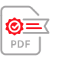

<TitleBlock slots="heading" theme="light" className="titleBlock-align-left e-seal-key-feature-title"/>

## Key features of PDF Electronic Seal API

<TextBlock slots="image, heading, text" width="33%" theme="light" className="align-left iocn-size  horizontal-align-heading e-seal-Benefits-one"/>

### Electronic seal application

Apply an electronic seal (e-seal) to PDF documents using a third-party digital certificate to verify the identity of the organization, to demonstrate the
authenticity  of the content, and show the timestamp of e-sealing.

<TextBlock slots="image, heading, text" width="33%" theme="light" className="align-left iocn-size  link horizontal-align-heading linking
e-seal-Benefits-two"/>

### E-seal verification

Verify the e-seal electronically using Adobe Acrobat and view the relevant tamper-evident credentials.

<TextBlock slots="image, heading, text" width="33%" theme="light" className="align-left iocn-size  link horizontal-align-heading linking e-seal-Benefits-three"/>

### Compliance with eIDAS

Use the API to apply "Simple" Electronic Seals, Advanced Electronic Seals (AdES) and Qualified Electronic Seals (QES) compliant with elDAS.

<TextBlock slots="image, heading, text" width="33%" theme="light" className="align-left iocn-size  link horizontal-align-heading linking e-seal-Benefits-four"/>

### Platform Agnostic REST API

E-seal documents easily at scale within end-to-end automated workflows. No hardware-based modules required.

<TextBlock slots="image, heading, text" width="33%" theme="light" className="align-left iocn-size  link horizontal-align-heading linking e-seal-Benefits-five"/>

### Customizable & easy to use

The API allows you to upload a PDF document, provide a customized e-seal image, specify third-party digital certificate credentials, and provide the coordinates for a visual e-seal to be applied to the document.

<TextBlock slots="image, heading, text" width="33%" theme="light" className="align-left iocn-size  link horizontal-align-heading linking e-seal-Benefits-six"/>

### Partnership with TSPs

The API supports certificates from certain TSPs (Trusted Service Provider) <a href="https://helpx.adobe.com/acrobat/kb/approved-trust-list1.html">AATL list (Adobe Approved Trust List)</a> that support OAuth authentication.