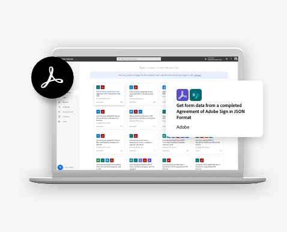

<TitleBlock slots="heading" theme="lightest" className="titleBlock-align-left explore-usecase-cta additional-resources-title"/>

## Learn more with these additional resources.

<ResourceCard slots="link, image,text2, heading, text, buttons" width="25%" theme='lightest' isFooter btnVarient='cta' contHeight='180px' className="useCaseCard resourceCardCont sales-cta ms-resource-card ms-resource-card-one" />

Webinar

### Build your first workflow.

Watch our Document Automation 101 webinar to see how easy it is to get started building a workflow with Adobe and Microsoft.

- [Watch webinar](https://www.adobe.com/documentcloud/webinars/document-automation-101-building-your-first-workflow-with-adobe-and-microsoft.html)

<ResourceCard slots="link, image, text2, heading, text, buttons" width="25%" theme='lightest' isFooter btnVarient='cta' contHeight='180px' className="useCaseCard resourceCardCont rental-cta ms-resource-card ms-resource-card-two"/>   

Article

### Create a document workflow.

Read how to build your first document workflow in Microsoft Power Automate.

- [Read article](https://business.adobe.com/customer-success-stories/ryder-case-study.html)

<ResourceCard slots="link, image, text2, heading, text, buttons" width="25%" theme='lightest' isFooter btnVarient='cta' contHeight='180px' className="useCaseCard new-hire-cta ms-resource-card ms-resource-card-three" />

Article

### Getting started with PDF Services.

Read how to get up and running in no time using the PDF services connector in Microsoft Power Automate.

- [Read article](https://business.adobe.com/customer-success-stories/cxc-case-study.html)

<ResourceCard slots="link, image, text2, heading, text, buttons" width="25%" theme='lightest' isFooter btnVarient='cta' contHeight='180px' className="useCaseCard financial-cta ms-resource-card ms-resource-card-four" />

Customer story

### Transform digital process.

See how CSU Fullerton is using Acrobat Sign and AEM Forms to transform digital processes across campus.

- [Read story](https://business.adobe.com/customer-success-stories/cal-state-fullerton-case-study.html)