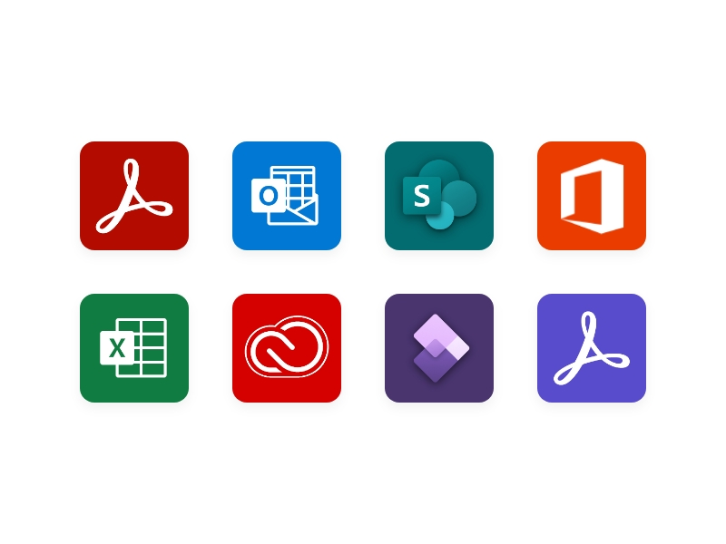

<TextBlock slots="image, heading,text,buttons" theme="lightest" headerElementType="h2" variantsTypePrimary='secondary'  isPrimaryBtn homeZigZag className="home-zigzag-comp-padding Adobe-PDF-Services-API ms-zigzag-cta-one zigzag-align"/>

### Low-code document automations.

With the Adobe PDF Services connector, select from over twenty PDF API actions such as PDF Extract, Document Generation, Create PDF, Convert PDF, and many more.

- [Learn more](https://docs.microsoft.com/en-us/connectors/adobepdftools/)

<TextBlock slots="heading,text,buttons,image" theme="lightest" headerElementType="h2" variantsTypePrimary='secondary'  isPrimaryBtn homeZigZag className="home-zigzag-comp-padding Adobe-PDF-Services-API ms-zigzag-cta-two zigzag-align"/>

### End-to-end workflows, complete with a signature.

Agreements, contracts, offer leers – you name it. Easily build workflows that need e-signatures with the Adobe Acrobat Sign connector.

- [Learn more](https://powerautomate.microsoft.com/en-us/connectors/details/shared_adobesign/adobe-sign)

<TextBlock slots="image, heading,text,buttons" theme="lightest" headerElementType="h2" variantsTypePrimary='secondary'  isPrimaryBtn homeZigZag className="home-zigzag-comp-padding Adobe-PDF-Services-API ms-zigzag-cta-three zigzag-align"/>

### Simplify workflows with templates.

Get started quickly with 75+ ready-to-use templates for workflows using Adobe PDF Services and Adobe Acrobat Sign connectors.

- [Learn more](https://powerautomate.microsoft.com/en-US/connectors/details/shared_adobepdftools/adobe-pdf-services/)

<TextBlock slots="heading,text,image" theme="lightest" headerElementType="h2" variantsTypePrimary='secondary'  isPrimaryBtn homeZigZag className="home-zigzag-comp-padding Adobe-PDF-Services-API ms-zigzag-cta-four zigzag-align"/>

### Easily incorporate forms through AEM.

Integrate Microsoft Dynamics and Power Automate with Adobe Experience Manager Forms for form review workflows. Deliver seamless enrollment experiences with Adobe and Microsoft solutions.

<TextBlock slots="image, heading,text" theme="lightest" headerElementType="h2" variantsTypePrimary='secondary'  isPrimaryBtn homeZigZag className="home-zigzag-comp-padding Adobe-PDF-Services-API ms-zigzag-cta-five zigzag-align"/>

### Build automations with extensibility.

Quickly extend your applications through hundreds of connectors in Microsoft Dataverse, Logic Apps, and more