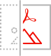

<TitleBlock slots="heading" theme="light"  className="titleBlock-align-left" />

## Why PDF embed API?

<TextBlock slots="image, heading, text" width="33%" theme="light" className="align-left icon-xl-size"  />

### Accurate, consistent PDF rendering

Whether on dynamic or static pages, deliver the highest quality PDF rendering available

<TextBlock slots="image, heading, text" width="33%" theme="light" className="align-left icon-xl-size" />

### Customizable user experience

Choose exactly how to display a PDF and use the callbacks and annotations APIs to provide programmatic control and enable digital collaboration

<TextBlock slots="image, heading, text" width="33%" theme="light"  className="align-left icon-xl-size" />

### Analytics on PDF usage

Use analytics to understand how users interact with PDFs, including time spent on a page and searches

<TextBlock slots="buttons" isCentered theme="light" className="margin-top-zero" />

* [Get free credentials](https://dc.stage.acrobat.com/dc-integration-creation-app-cdn/index.html?api=pdf-embed-api)