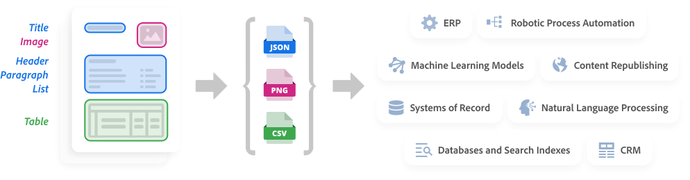

import PdfExtractResource from './pdf-extract/pdf-extract-resource.md';
import PdfExtractResourceTitle from './pdf-extract/pdf-extract-resource-title.md';
import ExtractStepperComponent from './pdf-extract/extract-stepper.md';
import WhyExtractAPI from './pdf-extract/why-extract-api.md';
import ExtractProductCard from './pdf-extract/extract-product.md';
import HowItWorks from './pdf-extract/how-it-works.md';

<Hero slots="heading, text, assetsImg, buttons" customLayout variant="fullwidth" className="herobgImage"/>

# Adobe PDF Extract API

Unlock the structure and content elements of any PDF with a web service powered by Adobe Sensei's machine learning.

apiHeroAssetImg doc-ext-invoice

- [Start free trial](https://dc.stage.acrobat.com/dc-integration-creation-app-cdn/index.html?api=pdf-extract-api)

<WrapperComponent slots="content" repeat="1" theme="light" className="padding-zero" enableMaxHeight/>

<WhyExtractAPI/>

<WrapperComponent slots="content" repeat="1" theme="lightest"/>

<PdfExtractResourceTitle/>

<WrapperComponent slots="content" repeat="1" theme="lightest" enableMaxWidth maxWidth='795px'/>

<PdfExtractResource/>

<TextBlock slots="buttons" isCentered theme="lightest"  className='padding-5'/>

- [See all Use case](/src/pages/use-cases/content-and-data-extraction/)

<WrapperComponent slots="content" repeat="1" theme="light"/>

<HowItWorks/>

<CustomIframeBlock source="https://video.tv.adobe.com/v/333506" theme="light"/>

<TextBlock slots="buttons"  theme="light" isCentered  className="padding-5"/>

* [Download JSON samples](https://adobe.com/go/dcExtract_sample)

<TextBlock slots="text1, text2  " theme="light"  className="media-horizantal-align  how-it-work-text mediaSize link"/>

Adobe PDF Extract API is powered by [Adobe Sensei](https://www.adobe.com/sensei.html), an industry-leading Artificial Intelligence (AI) and Machine Learning (ML) network. The technology enables a rich understanding of documents, such as the identification of elements, including position and connections relative to other elements. In addition, it can determine reading order. These and other capabilities ensure the most comprehensive output of structured content.

Extracted content is output in a structured JSON file – with tables optionally included as CSV or XLSX files and images saved as PNG files – so developers can easily store, analyze, and manipulate the data in a variety of downstream systems. Examples include databases, systems of record, CRM, ERP, NLP, RPA as well as ML models and analytic tools.

<TextBlock slots="image" theme="light"  imgWidth="100%" className="media-horizantal-zero-padding  how-it-work-image mediaSize "/>

<TextBlock slots="text" theme="light" isCentered className="media-bottom-padding link position-up"/>

We take security serously - check out our [security overview](https://www.adobe.com/content/dam/cc/en/security/pdfs/AdobeDocumentServices_SecurityOverview.pdf)

<WrapperComponent slots="content" repeat="1" theme="lightest "/>

<ExtractStepperComponent />

<WrapperComponent slots="content" repeat="1" theme="light"/>

<ExtractProductCard/>

<SummaryBlock slots="image, heading, text, buttons" theme="lightest" background="white" />

### We're ready to help

Have questions about the Document Services APIs?

- [Go to the Adobe Forum](https://www.adobe.com/go/pdftoolsapi_forum)
- [Contact us](../pricing/contact.md)

