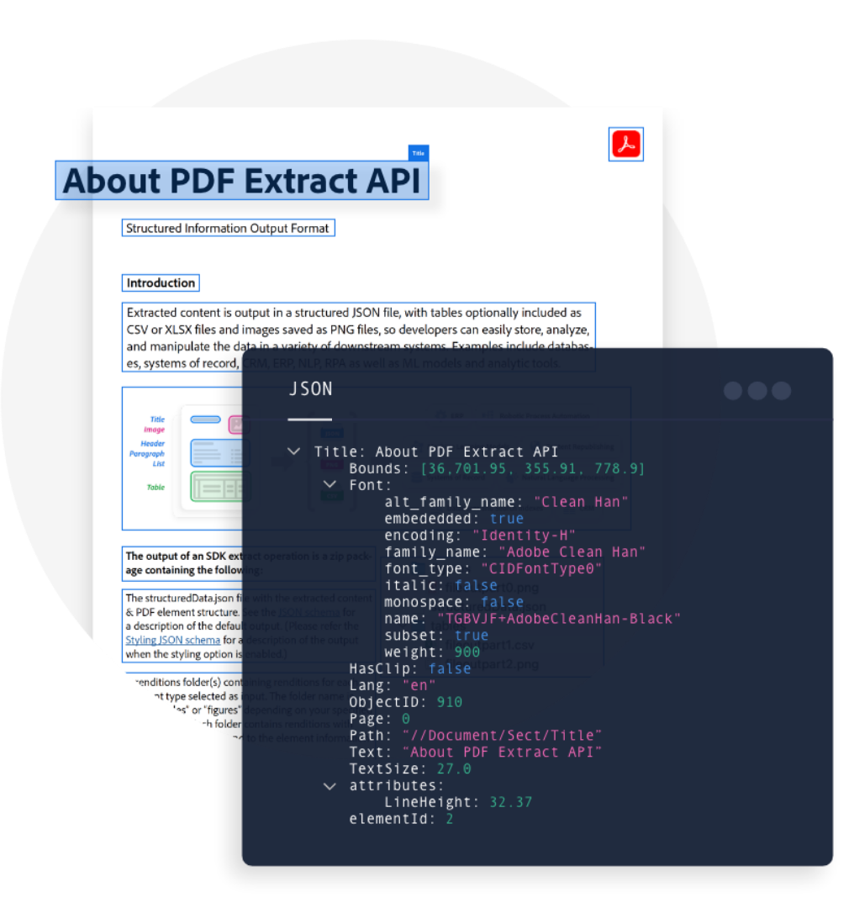

<TextBlock slots="heading,text,buttons,image" theme="light" className="padding-zero-visualizer see-how-it-works how-it-work-font how-it-work-text-align how-it-work-img-align how-it-work-img-Z"/>

### See how it works.

Check out the interactive demo that shows a sample 
PDF input and the JSON output side-by-side. Click on a section of the PDF 
to see the corressponding JSON output. You can extract a variety of elements such as 
paragraphs, headers, tables, and figures/images.
  
- [Interactive demo](https://www.adobe.com/go/extract_visualizer)
- [Watch the video](https://video.tv.adobe.com/v/333506)

<TextBlock slots="heading, text" theme="light"  className="how-it-work-richText padding-zero-visualizer rich-text-data how-it-work-font"/>

 ### Turn your PDF into rich data.

 Extracted content is output in a structured JSON file - with tables optionally included as CSV or XLSX files and images
 saved as PNG files-so you can easily store, analyze, and manipulate the data in a variety of downstream systems.

<TextBlock slots="assetImg" theme="light" width="100%" imageOnly className="padding-zero-visualizer media-bottom-padding"/>

how-it-work-img

<TextBlock slots="text" theme="light" isCentered className="media-bottom-padding link position-up linking How-it-works sec-overview"/>

We take security seriously - check out our [security overview](https://www.adobe.com/content/dam/cc/en/security/pdfs/AdobeDocumentServices_SecurityOverview.pdf)