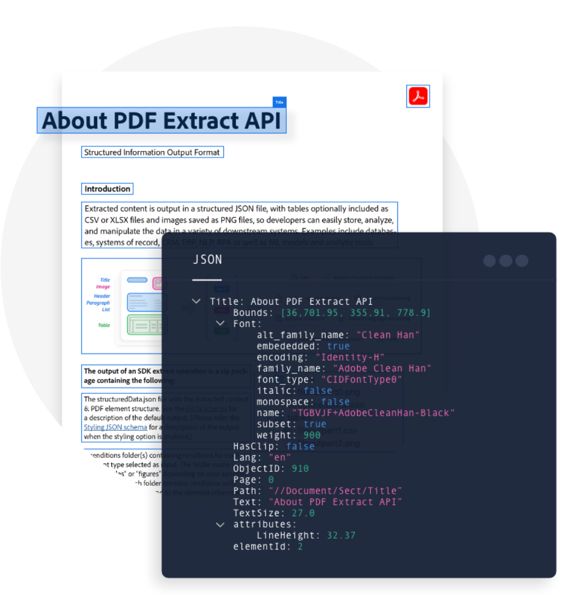

<TextBlock slots="heading,text,buttons,image" theme="light" className="padding-zero-visualizer see-how-it-works how-it-work-font how-it-work-text-align how-it-work-img-align how-it-work-img-Z"/>

### See structured JSON extraction in action.

Check out the interactive demo that shows a sample
PDF input and the JSON output side-by-side. Click on a section of the PDF
to see the corressponding JSON output. You can extract a variety of elements such as
paragraphs, headers, tables, and figures/images.

- [Interactive demo](https://acrobatservices.adobe.com/dc-visualizer-app/index.html)
- [Watch the video](https://video.tv.adobe.com/v/333506)

<TextBlock slots="heading, text" theme="light"  className="how-it-work-richText padding-zero-visualizer rich-text-data how-it-work-font"/>

### Turn your PDF into rich data.

 PDF Extract provides two output formats through separate endpoints, both powered by the same underlying Adobe extraction technology:
 * Markdown, PDF to Markdown endpoint (/operation/pdftomarkdown): Returns well-formatted, LLM-friendly Markdown that preserves document structure and reading order. Tables are converted to Markdown syntax, and figures can be included as base64-embedded images.
 * Structured JSON, Extract PDF endpoint (/operation/extractpdf): Returns detailed content and document structure data in JSON. Tables can also be output as CSV or XLSX files, and figures as PNG files.

<TextBlock slots="assetImg" theme="light" width="100%" imageOnly className="padding-zero-visualizer media-bottom-padding"/>

how-it-work-img

<TextBlock slots="text" theme="light" isCentered className="media-bottom-padding link position-up linking How-it-works sec-overview"/>

We take security seriously - check out our [security overview](https://www.adobe.com/content/dam/cc/en/security/pdfs/AdobeDocumentServices_SecurityOverview.pdf)
