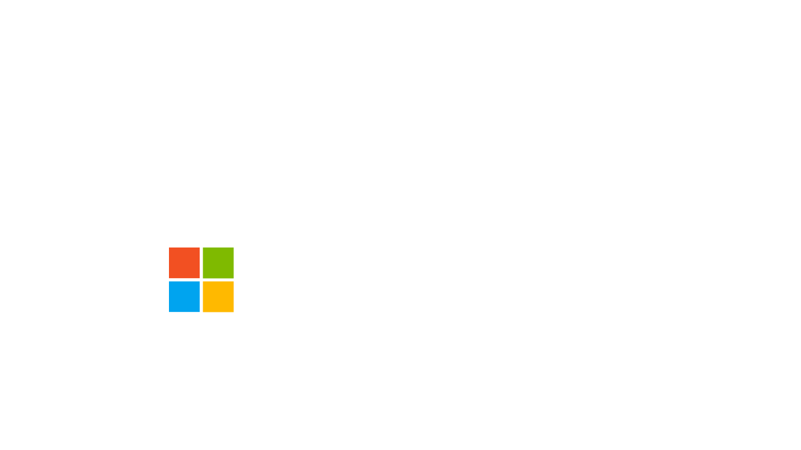

<Carousel slots="bgimage, image, heading, text, buttons" repeat="2"  theme="lightest" enableNavigation slideTheme='dark' className="carousel-padding-top-zero" varient="fullWidth" navigationNext="white-swiper-button" navigationPre="white-swiper-button" isCenter  />

carousel-adobe

## AWS marketplace partnership

### We now offer all of our PDF Services APIs for purchase as a subscription in AWS console

- [Learn more](/src/pages/pdf-pricing.md#AWS)

carousel-micosoft

## Microsoft Power Automate Integration

### Quickly automate document processes without writing any code using the new Adobe PDF Services Connector.

- [Learn more](http://www.adobe.com/go/powerautomate_help)