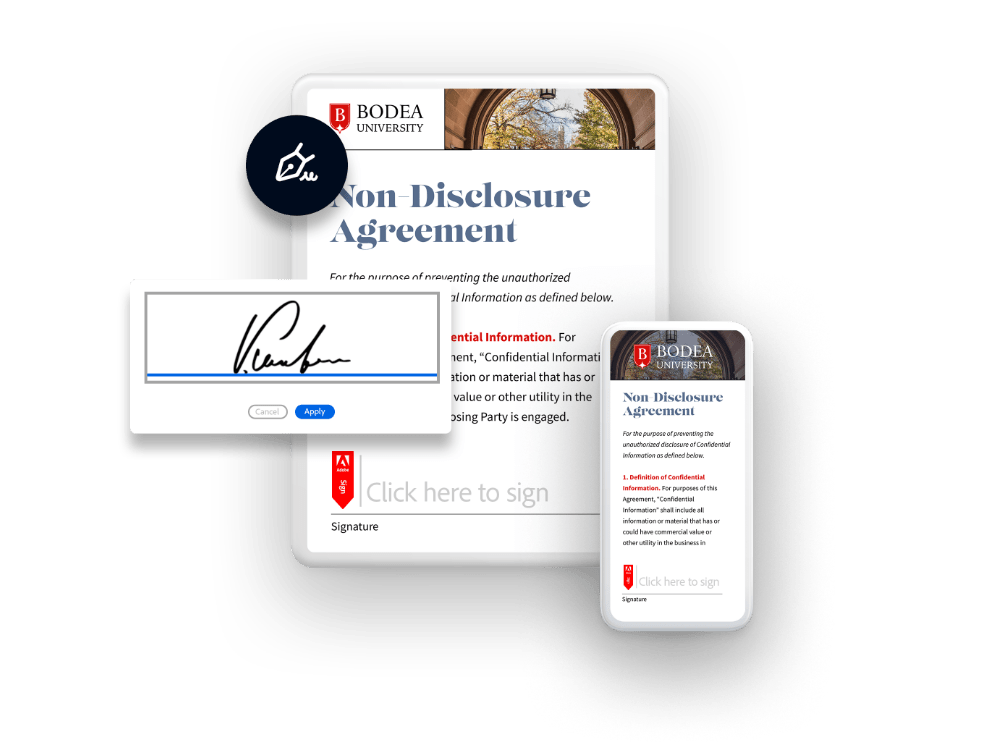
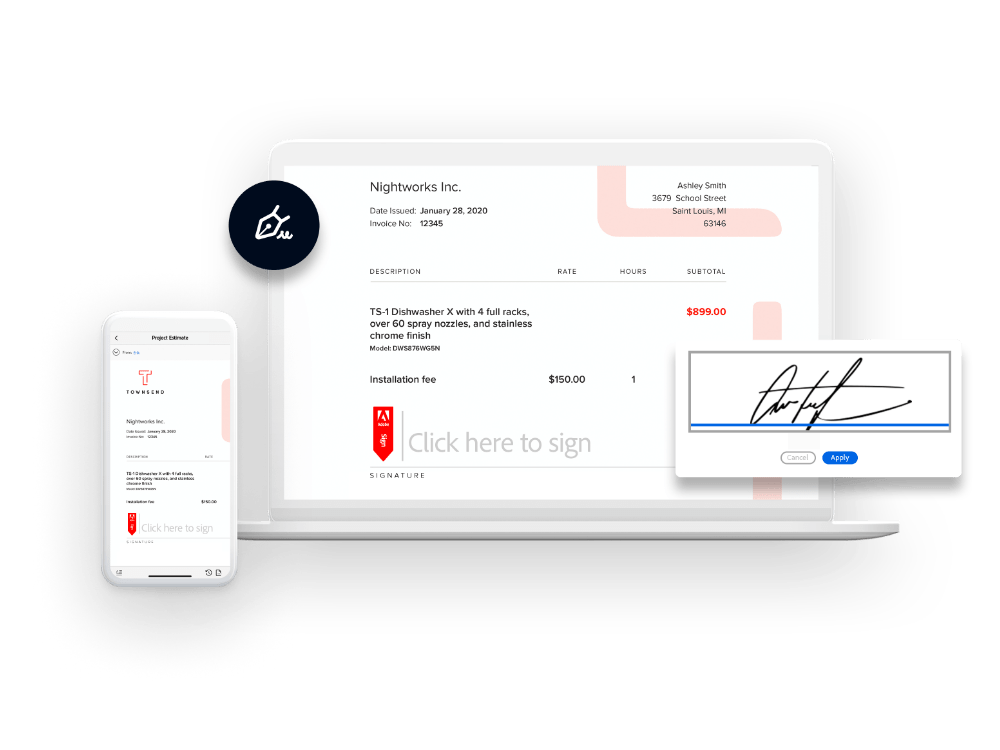
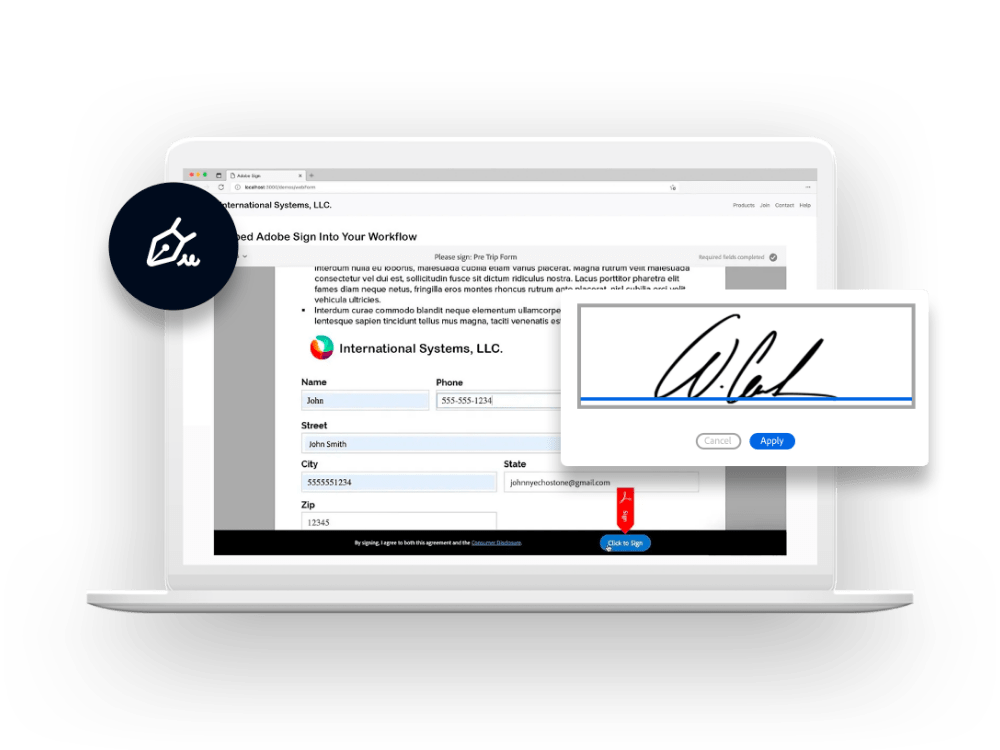

import PartnerWithUsBlade from './sign-api/partner-with-us.md'
import TakeYourProject from './sign-api/take-your-project-nxt-lvl.md'
import TakeYourProjectCont from './sign-api/take-your-project-content.md'
import PartnershipType from './sign-api/partnership-type.md'
import Usecase from './sign-api/use-case.md'
import OurPartners from './sign-api/our-partners.md'
import OurPartnersTwo from './sign-api/our-partners-two.md'

<Hero slots="heading, text, assetsImg, buttons" customLayout primaryOutline variant="fullwidth" primaryOutline variantsTypeSecondary='primary'  className="signApiHerobgImage Hero-Banner hero-btn-color"/>

# Elevate customer experiences with secure, trusted e-signatures.

Adobe Acrobat Sign APIs make it easy for developers like you to integrate e-signature capabilities into mobile apps, websites, or other platforms.

apiHeroAssetImg sign-api-hero

- [Create account](https://www.adobe.com/sign/developer-form.html)

- [View documentation](https://opensource.adobe.com/acrobat-sign/developer_guide/)

<PartnerWithUsBlade/>

<WrapperComponent slots="content" repeat="1" theme="lightest" className="why-pdf-services Why-PDF-Services-API"/>

<TakeYourProject/>

<WrapperComponent slots="content" repeat="1" theme="lightest" className="padding-zero Key-features-of-Adobe-PDF-Extract-API"/>

<TakeYourProjectCont/>

<WrapperComponent slots="content" repeat="1" theme="light" className="padding-zero Key-features-of-Adobe-PDF-Extract-API"/>

<PartnershipType/>

<TextBlock slots="image, heading,text,buttons" theme="lightest" headerElementType="h2" variantsTypePrimary='secondary'  isPrimaryBtn homeZigZag className="home-zigzag-comp-padding Adobe-PDF-Services-API zigzag-cta-one"/>

### Merge data from your application.

Merge and prefill data directly from you application and send documents for signature. Save time by pre-populating data fields customizing inputs, and more -- all based on your application's unique needs.

- [Access API samples](https://opensource.adobe.com/acrobat-sign/developer_guide/samples.html)

<TextBlock slots="heading,text,buttons,image" theme="lightest" headerElementType="h2" variantsTypePrimary='secondary'  isPrimaryBtn homeZigZag className="home-zigzag-comp-padding Adobe-PDF-Services-API zigzag-cta-two"/>

### Store documents in your own repository.

Adobe, with our Document Generation API and other PDF Services APIs, makes it easy for you to build end-to-end workflows. You can send documents for signature, track and manage status, and automatically route them to your own storage archive or repository. it gives you even greater flexibility with security you can rely on.

- [View e-signature workflows](https://opensource.adobe.com/acrobat-sign/developer_guide/apiusage.html#send-for-signing-create-an-agreement)

<TextBlock slots="image, heading,text,buttons" theme="lightest" headerElementType="h2" variantsTypePrimary='secondary'  isPrimaryBtn homeZigZag className="home-zigzag-comp-padding Adobe-PDF-Services-API zigzag-cta-three"/>

### OEM implementation made easy.

Add e-signatures as a feature or service within your own application and deliver an all-digital experience in days -- not weeks or months. Acrobat Sign APIs give you the flexibility to integrate the experience for maximum control and customization.

- [Learn more](https://adobe.lookbookhq.com/adobesignpartnerpgm/buildtestdeliver)

<WrapperComponent slots="content" repeat="1" theme="light" className="why-pdf-services Why-PDF-Services-API"/>

<Usecase/>

<TextBlock slots="buttons" isCentered theme="light" variantsTypePrimary='secondary'  isPrimaryBtn  className='padding-5 Use-cases-for-Adobe-Document-Services view-all-cta'/>

- [View all use cases](/src/pages/use-cases/agreements-and-contracts/sales-proposals-and-contracts/)

<WrapperComponent slots="content" repeat="1" theme="lightest" className="why-pdf-services Why-PDF-Services-API"/>

<OurPartners/>

<WrapperComponent slots="content" repeat="1" theme="lightest" className="why-pdf-services Why-PDF-Services-API"/>

<OurPartnersTwo/>