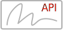

<TextBlock slots="image, heading, text1, text2" width="33%" theme="lightest" className="align-left icon-xl-size padding-top-zero horizontal-align-heading link py-0 easy-to-implement-cta" />

### Easy to implement.

Acrobat Sign service features are available via easy-to-use REST APIs. Integrate e-signatures into your platform, application, or workflow in a snap.

[Learn more](https://secure.na1.adobesign.com/public/docs/restapi/v6)

<TextBlock slots="image, heading, text1, text2" width="33%" theme="lightest" className="align-left icon-xl-size padding-top-zero horizontal-align-heading link py-0 secure-compliant-cta" />

### Secure and compliant.

Acrobat Sign meets or exceeds industry security standards such as Auth v2.0 for authentication. And with our Microsoft Power Automate connector, low-code e-signature
automation is a reality.

[Learn more](https://www.adobe.com/content/dam/cc/en/security/pdfs/AdobeSign_SecurityOverview.pdf)

<TextBlock slots="image, heading, text1, text2" width="33%" theme="lightest" className="align-left icon-xl-size padding-top-zero horizontal-align-heading link py-0 scalable-cta" />

### Scalable.

Our global data centers are resilient and designed to deliver high availability. Acrobat Sign scales and adapts to meet a variety of unique needs and workflows.       

[Learn more](https://helpx.adobe.com/sign/using/adobesign-data-centers.html)