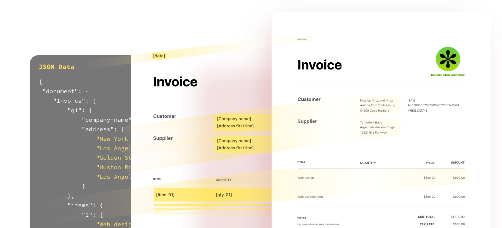

import DgDownloadSample from './doc-generation/dg-download-sample'
import DgUseCaseDocServiceAPI from './doc-generation/dg-use-case-doc-service-api'
import DgStartModifyingTitle from './doc-generation/dg-start-modifying-pdf.md'
import DgWhyDocTitle from './doc-generation/dg-why-doc-gen-api.md'
import DgKeyFeatures from './doc-generation/dg-key-features.md'
import DgExploreOtherAdobeDoc from './doc-generation/dg-explore-other-adobe-doc.md'
import {MobileOptimize} from '../components/mobileOptimize'
import '../styles/doc-generation.css'

<Hero slots="image, heading, text, assets, buttons" customLayout variant="fullwidth" background="rgb(250, 105, 85)" className="homeHeroAssetImg"/>

# Adobe document generation API

Generate PDF and Word documents from World templates and JSON data

- [Try the demo](https://adobe.com/go/dcdocgen_api_demo) 

<!-- Why Document Generation API -->

<WrapperComponent slots="content" repeat="1" theme="lightest"/>
<DgWhyDocTitle/>

<TextBlock slots="buttons" isCentered theme="lightest padding-top-zero why-doc-get-started-btn" primaryOutline/>

- [Product overview video](https://video.tv.adobe.com/v/332120) 
- [Start free trial](https://www.adobe.com/go/dcsdks_credentials?ref=getStartedWithServicesSDK)

<!-- Key Features of Adobe Document Generation API -->
<WrapperComponent slots="content" repeat="1" theme="light"/>
<DgKeyFeatures/>

<TextBlock slots="buttons" isCentered theme="light padding-5 why-doc-get-started-btn"/>

- [Start free trial](https://www.adobe.com/go/dcsdks_credentials?ref=getStartedWithServicesSDK)

<MobileOptimize/>

<!-- Download Sample Templates and Data to Get Started -->

<WrapperComponent slots="content" repeat="1" theme="lightest"/>

<DgDownloadSample/>

<TextBlock slots="buttons" theme="lightest" isCentered className='blade-bottom-content ms-word-add-in-title'/>

- [Get Microsoft Word add-in](https://www.adobe.com/go/pdfEmbedAPI_demo)
- [See all templates](./doc-gen-api-template.md)

<!--  Start Modifying PDFs in a few Minutes -->
<WrapperComponent slots="content" theme="light"/>
<DgStartModifyingTitle/>

<!-- Use case for Document Services API -->
<WrapperComponent slots="content" repeat="1" theme="lightest"/>

<DgUseCaseDocServiceAPI/>

<TextBlock slots="buttons" theme="lightest" isCentered className="view-all-use-case-btn"/>

- [See all Use Case](https://www.adobe.io/apis/documentcloud/dcsdk/sales-proposals-and-contracts.html)

<!-- Explore other Adobe Document Cloud services -->

<WrapperComponent slots="content" repeat="1" theme="light"/>
<DgExploreOtherAdobeDoc/>

<!-- Summary Block -->
<SummaryBlock slots="image, heading, text, buttons" theme="lightest" background="white"/>

### We're ready to help 

Have questions about the Document Services APIs ?

- [Go to the Adobe Forum](https://www.adobe.com/go/pdftoolsapi_forum)
- [Contact us](src/pages/contact-us)
