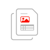
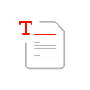

<TitleBlock slots="heading" theme="light" className="titleBlock-align-left"/>

## Explore other adobe document services

<ProductCard slots="icon, heading, text, buttons" theme="light" width="33%" className="product-card-compact"/>

#### Services

Create a PDF from Microsoft Office documents, protect the content, and export to other formats

* [Learn more](https://adobe.io)
* [Demo](https://adobe.io)

<ProductCard slots="icon, heading, text, buttons" theme="light" width="33%" className="product-card-compact"/>

#### Extract

Extract text, table, images and document structure.

* [Learn more](https://adobe.io)
* [Demo](https://adobe.io)

<ProductCard slots="icon, heading, text, buttons" theme="light" width="33%" className="product-card-compact"/>

#### Generate

Generate PDF and word documents from custom word templates 

* [Learn more](https://adobe.io)
* [Demo](https://adobe.io)