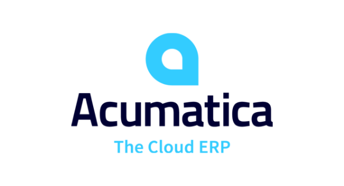

<Carousel slots="image, text1, text2" repeat="5"  theme="light" enableNavigation  className="carousel-padding-top-zero"/>

“Our clients wanted to create PDFs of our reports and the open source solution we tried was difficult to work with and unreliable. We switched to the Adobe Services SDK because it produced higher quality PDFs and also let our clients convert to PowerPoint to customize reports for their audience.”

**– Tim Hill, CEO & Co-Founder, Social Status**

“We are committed to building superior collaboration and user experiences on our platform, and with PDF APIs from Adobe, we enabled the world’s best document experiences with ease — right within the Acumatica ERP solution.”

**– John Roskill, CEO, Acumatica Cloud ERP**

“Adobe Acrobat Services helped us extend K2’s intelligent process automation solution to enable
integrated PDF document creation with a rich, interactive web experience for document review,
approval, and e-signature processes with Adobe Acrobat Sign. Our developers were able to easily extend K2
workflows that collect information from multiple data sources using Adobe Acrobat Services APIs,
enabling us to quickly deliver a solution for our customers to automate their document-oriented business processes in a more secure and scalable way.”

**– Alex Cobb, VP Product Management, K2**

“With the 99U Conference shifting to an all-virtual format this year, we wanted to make all aspects of the
event accessible to our attendees — especially The Creative Self Workbook, a workbook offering a
chance for deep self-discovery and exploration. The Adobe PDF Embed API allowed us to create an
accessible, seamless PDF experience with live form filling, notes, drawing, downloading, and printing
options with just a few lines of code.”

**– Andrea Rosen, Head of 99U**

“InfoDesk provides AI-driven technology and tools that enable organizations to make the smartest
decisions confidently. This involves delivering highly relevant insights to our customers in a format that
suits them best so they can harness the value of their information. By using Adobe’s Acrobat Services
API, our customers can easily convert PDF reports to PowerPoint for use in client presentations and
internal stakeholder meetings. At InfoDesk, we are always looking for ways to add value for our clients
and Adobe enables us to do exactly that.”

**– Lynn Epstein, COO, InfoDesk**
