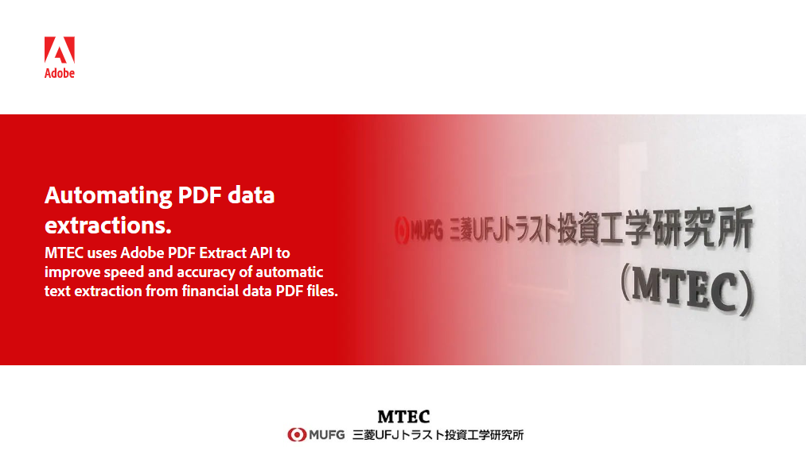
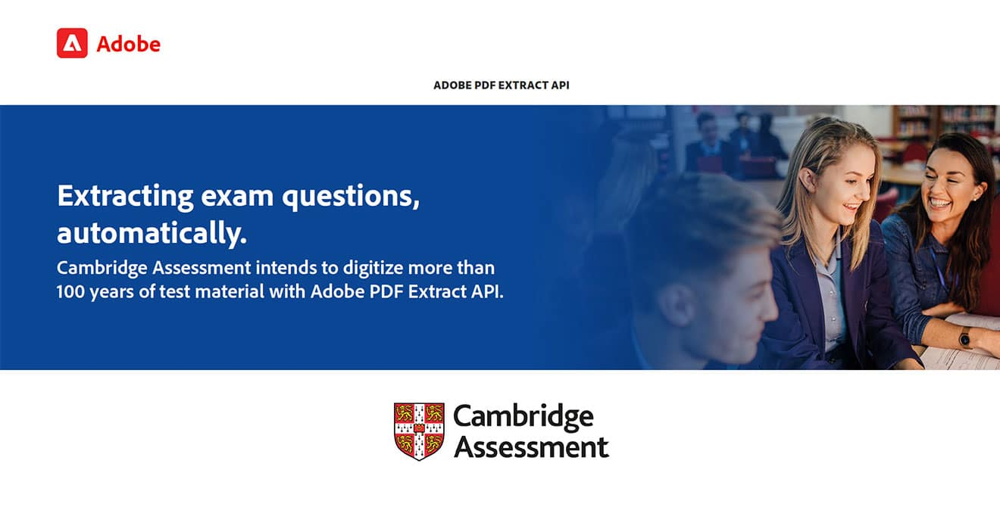
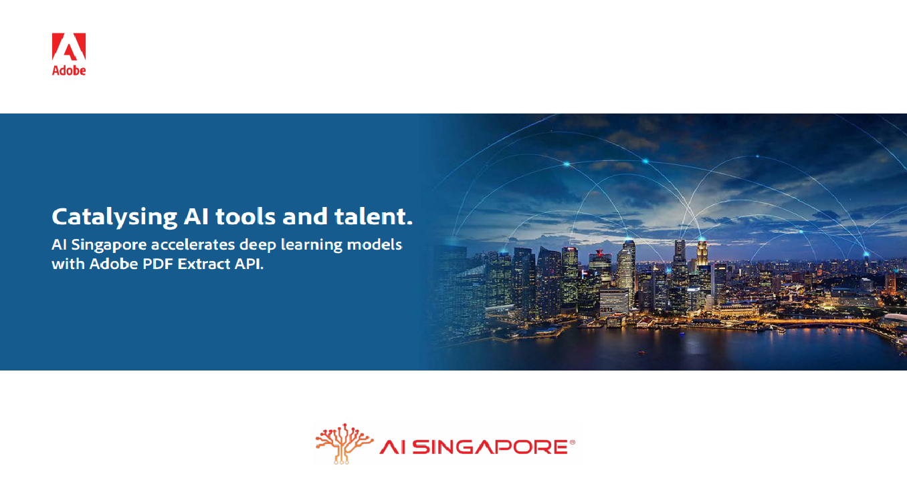

<TitleBlock slots="heading, text" theme="lightest" className="titleBlock-align-left" id="customer" />

### Customer stories

See how our customers are building great experiences and succeeding with Adobe.

<ResourceCard slots="link, image, heading,text" width="25%" theme="lightest"  className='useCaseCard card-heading-size' isCustomStories/>

[mtec-story.pdf](../resources/mtec-story.pdf)

### MTEC

MTEC uses Adobe PDF Extract API to improve speed and accuracy of automatic text extraction from financial data PDF files.

<ResourceCard slots="link, image, heading, text " width="25%" theme="lightest" className='useCaseCard card-heading-size' isCustomStories/>

[AdobeExpCloudStory.pdf](../resources/AdobeExpCloudStory.pdf)

### AE Customer Story

Agreement Experience is projected to save deal desk and sales attorneys 36,000 hours annually on contracts.

<ResourceCard slots="link, image, heading,text" width="25%" theme="lightest" className='useCaseCard card-heading-size hme-custom-header' isCustomStories/>

[Cambridge-Assessment.pdf](../resources/Cambridge-Assessment.pdf)

### Cambridge Assessment

Cambridge Assessment intends to digitize more than 100 years of test material with Adobe PDF Extract API.

<ResourceCard slots="link, image, heading,text" width="25%" theme="lightest" className='useCaseCard card-heading-size' isCustomStories/>

[AI-Singapore-Story](../resources/AI-Singapore-Story.pdf)

### AI Singapore (AISG)

AI Singapore accelerates deep learning models with Adobe PDF Extract API.
