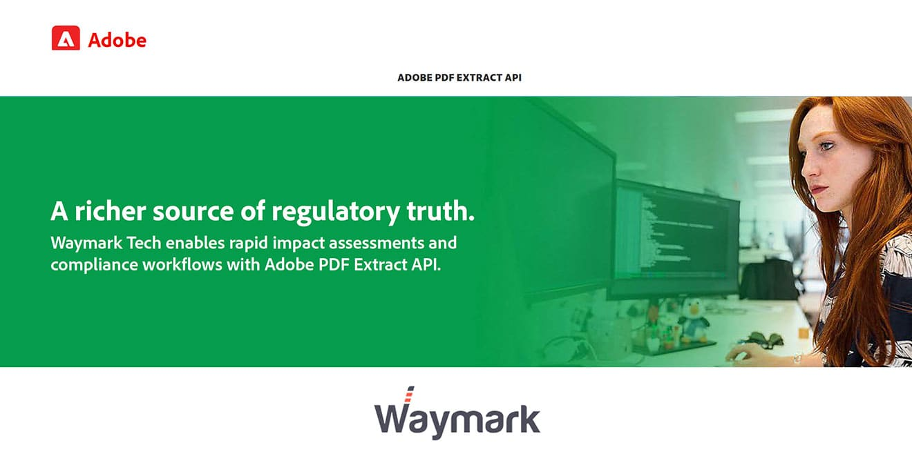
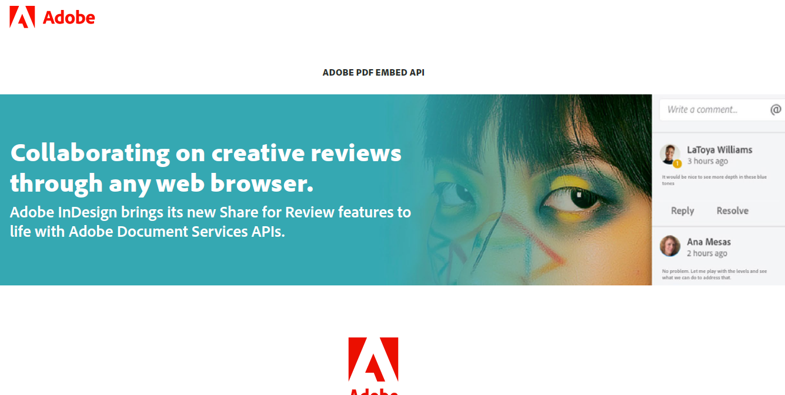
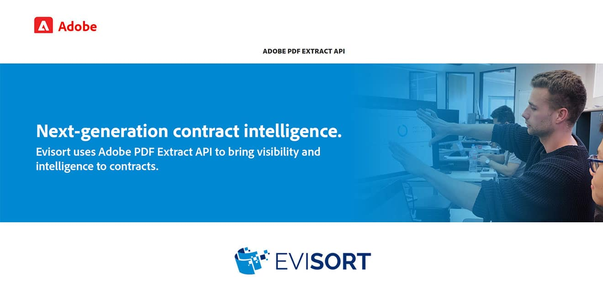

<TitleBlock slots="heading, text" theme="lightest" className="titleBlock-align-left" id="customer" />

### Customer stories

See how our customers are building great experiences and succeeding with Adobe.

<ResourceCard slots="link, image, heading,text" width="25%" theme="lightest"  className='useCaseCard card-heading-size' isCustomStories/>

[Waymark-Story.pdf](../resources/Waymark-Story.pdf)

### Waymark

Waymark Tech enables rapid impact assessments and compliance workflows with Adobe PDF Extract API.

<ResourceCard slots="link, image, heading, text " width="25%" theme="lightest" className='useCaseCard card-heading-size' isCustomStories/>

[AdobeInDesign.pdf](../resources/AdobeInDesign.pdf)

### ADOBE INDESIGN

Adobe InDesign brings its new Share for Review features to life with Adobe Document Services APIs.

<ResourceCard slots="link, image, heading,text" width="25%" theme="lightest" className='useCaseCard card-heading-size' isCustomStories/>

[Cambridge-Assessment.pdf](../resources/Cambridge-Assessment.pdf)

### CAMBRIDGE ASSESSMENT

Cambridge Assessment intends to digitize more than 100 years of test material with Adobe PDF Extract API.

<ResourceCard slots="link, image, heading,text" width="25%" theme="lightest" className='useCaseCard card-heading-size' isCustomStories/>

[Evisort.pdf](../resources/Evisort.pdf)

### EVISORT

Evisort uses Adobe PDF Extract API to bring visibility and intelligence to contracts.