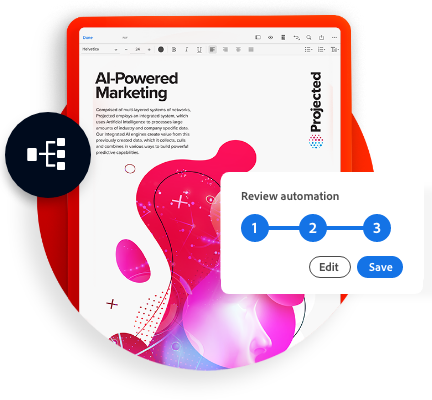

<TitleBlock slots="heading" theme="lightest" className="titleBlock-align-left"/>

## Why Document Services?

<TextBlock slots="image,heading,text" width="33%" theme="lightest"  className="align-left img-m-size horizontal-align-heading home-list-points"/>

### Invent new document experiences

- Unlock productivity through APIs and integrations.

- Use Microsoft Power Automate connectors to build without code.

- Leverage integrations with AEM, Adobe Analytics, and Adobe Sign.

<TextBlock slots="image,heading,text" width="33%" theme="lightest"   className="align-left img-m-size horizontal-align-heading home-list-points"/>

### Built for developers

- Easy to implement REST APIs and SDKs.

- Secure, reliable, and scalable.

- Pay only for what you need.

<TextBlock slots="image, heading, text" width="33%" theme="lightest"  className="align-left img-m-size horizontal-align-heading home-list-points"/>

### From the leader

- 25+ years of PDF expertise.

- Battle tested by 20M+ users.

- Innovating with AI/ML in digital documents powered by Adobe Sensei.