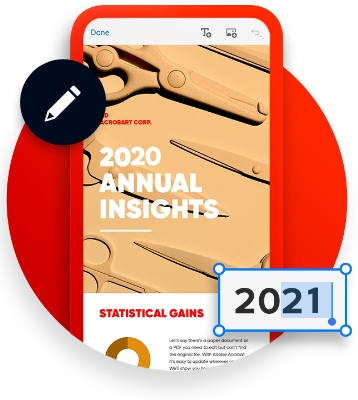
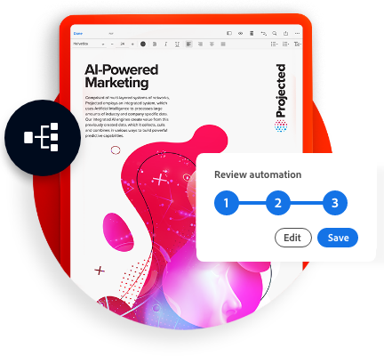
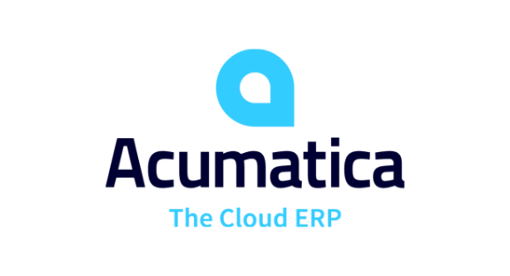
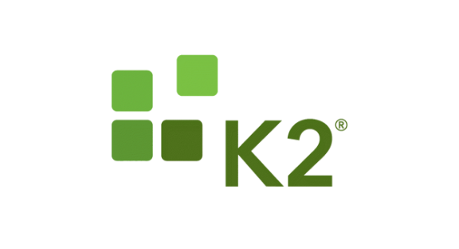

import '../styles/main.scss'
import CreatePdfFromUrl from './home/create-pdf-from-url.md';
import DynamicPdfDocumentGeneration from './home/dynamic-pdf-document-generation.md';
import ExtractPdfContentStructure from './home/pdf-content-structure.md';
import EmbedPdfViewingAnalytics from './home/embed-pdf-viewing-analytics.md';
import HomeResourceCard from './home/home-resource.md'
import HomeProduct from './home/home-product.md'

<Hero slots="image, icon, heading, text1" variant="halfwidth" />

# Reimagine document experiences with PDF APIs designed for developers

From the company who created the PDF standard.

<TextBlock slots="image,icons,heading,text,buttons" theme="light"  className="link-align text-blade-padding"/>

*  [PDF Embed API](https://www.adobe.com/products/aftereffects.html)

### PDF Embed API to insert PDFs and enable collaboration in web apps

Leverage the free javascript API to embed PDFs without the need for end users to download additional plugins. Provide a rich PDF viewing and easily enable digital collaboration and document analytics.

- [Demo](https://www.adobe.com/go/pdfEmbedAPI_demo)

<TextBlock slots="icons,heading,text,buttons,image" theme="lightest"  className="link-align text-blade-padding"/>

*  [Document Generation API](https://www.adobe.io/apis/documentcloud/dcsdk/doc-generation.html)

### Generate PDF and Word documents from Word templates and JSON data

Use the PDF Tools API to quickly solve specific challenges or power multi-step document workflows, with SDKs for Node.js, Java and .Net. Apply OCR to enable searching, easil convert files(HTML to PDF, PDF to Microsoft Word and more), or combine actions to automate workflows.

- [Demo](https://documentcloud.adobe.com/dc-docgen-playground/index.html#/)

<TextBlock slots="image,icons,heading,text,buttons" theme="light" className="link-align text-blade-padding"/>

*  [PDF Extract API](https://www.adobe.io/apis/documentcloud/dcsdk/pdf-extract.html)

### Unluck content structure in any PDF for NLP, RPA, and more

Leverage the free javascript API to embed PDFs without the need for end users to download additional plugins. Provide a rich PDF viewing and easily enable digital collaboration and document analytics.

- [Demo](https://www.adobe.io/apis/documentcloud/dcsdk/pdf-extract.html)

<TextBlock slots="icons,heading,text,buttons,image" theme="lightest" className="link-align text-blade-padding"/>

*  [PDF Services API](https://www.adobe.io/apis/documentcloud/dcsdk/pdf-services.html)

### PDF APIs with SDKs for Node.js, .Net, and java to create, convert, OCR PDFs, and more

Use the PDF Tools API to quickly solve specific challenges or power multi-step document workflows, with SDKs for Node.js, Java and .Net. Apply OCR to enable searching, easil convert files(HTML to PDF, PDF to Microsoft Word and more), or combine actions to automate workflows.

- [Demo](https://www.adobe.io/apis/documentcloud/dcsdk/pdf-services.html)

<SummaryBlock slots="heading, text" background="rgb(31, 42, 73)"  className='align-left-codeblock-title align-left-codeblock-0 '/>

## Designed for Developers

Use our cloud-based REST APIs and SDKs designed for developers to build new, innovative document solutions. Pick and choose from over 15 different PDF and document manipulation APIs to build custom end-to-end agreements, content publishing, data analysis workflow experiences, and more. Get started in minutes with our SDKs for Node.js, .Net, Java, and sample Postman collection.

<TabsBlock orientation="vertical" slots="heading, image, tabViewContent" repeat="4"  theme="dark" className='bgBlue code-block-0' />

### Create PDF from URL

<CreatePdfFromUrl/>

### Dynamic PDF Document Generation

<DynamicPdfDocumentGeneration/>

### Extract PDF Content & Structure

<ExtractPdfContentStructure/>

### Embed PDF for viewing and analytics

<EmbedPdfViewingAnalytics/>

<TitleBlock slots="heading" theme="lightest" />

## Why Document Services?

<TextBlock slots="image,heading,text" width="33%" theme="lightest"  className="align-left img-m-size"/>

### Invent New Document Experiences

Unlock productivity through APIs and integrations.Use Microsoft Power Automate connectors to build without code.Leverage integrations with AEM, Adobe Analytics and Adobe Sign.

<TextBlock slots="image,heading,text" width="33%" theme="lightest"   className="align-left img-m-size"/>

### Built for Developers

Easy to implement REST APIs and SDKs. Secure, reliable, and scalable. Pay only for what you need.

<TextBlock slots="image, heading, text" width="33%" theme="lightest"  className="align-left img-m-size"/>

### From the Leader

25+ years of PDF expertise. Battle tested by 20M+ users. Innovating with AI/ML in digital documents powered by Adobe Sensei.

<TitleBlock slots="heading" theme="light" />

## Use Cases for Document Services API

<WrapperComponent slots="content" repeat="1" theme="light"/>

<HomeResourceCard />

<TextBlock slots="buttons" isCentered theme="light"  className='blade-bottom-content'/>

- [See all Use Cases](/src/pages/use-cases)

<TitleBlock slots="heading" theme="dark" className="padding_top_align"/>

## Customer Success Block

<Carousel slots="image, text1, text2" repeat="5"  theme="dark" enableNavigation slideTheme='light' className="carousel-padding-top-zero"/>

“Our clients wanted to create PDFs of our reports and the open source solution we tried was difficult to work with and unreliable. We switched to the Adobe Services SDK because it produced higher quality PDFs and also let our clients convert to PowerPoint to customize reports for their audience.”

**– Tim Hill, CEO & Co-Founder, Social Status**

“We are committed to building superior collaboration and user experiences on our platform, and with PDF APIs from Adobe, we enabled the world’s best document experiences with ease — right within the Acumatica ERP solution.”

**– John Roskill, CEO, Acumatica Cloud ERP**

“Adobe Document Services helped us extend K2’s intelligent process automation solution to enable
integrated PDF document creation with a rich, interactive web experience for document review,
approval, and e-signature processes with Adobe Sign. Our developers were able to easily extend K2
workflows that collect information from multiple data sources using Adobe Document Services APIs,
enabling us to quickly deliver a solution for our customers to automate their document-oriented business processes in a more secure and scalable way.”

**– Alex Cobb, VP Product Management, K2**

“With the 99U Conference shifting to an all-virtual format this year, we wanted to make all aspects of the
event accessible to our attendees — especially The Creative Self Workbook, a workbook offering a
chance for deep self-discovery and exploration. The Adobe PDF Embed API allowed us to create an
accessible, seamless PDF experience with live form filling, notes, drawing, downloading, and printing
options with just a few lines of code.”

**– Andrea Rosen, Head of 99U**

“InfoDesk provides AI-driven technology and tools that ena ble organizations to make the smartest
decisions confidently. This involves delivering highly relevant insights to our customers in a format that
suits them best so they can harness the value of their information. By using Adobe’s Document Service
API, our customers can easily convert PDF reports to PowerPoint for use in client presentations and
internal stakeholder meetings. At InfoDesk, we are always looking for ways to add value for our clients
and Adobe enables us to do exactly that.”

**– Lynn Epstein, COO, InfoDesk**

<TitleBlock slots="heading" theme="light" />

## Explore other Adobe Document Cloud Services

<WrapperComponent slots="content" repeat="1" theme="light"/>

<HomeProduct />

<SummaryBlock slots="image, heading, text, buttons" background="rgb(250, 105, 85)" className="bottom-summar-block-align"/>

### We'r ready to help 

Have questions about the Document Services APIs? [Contact us](https://www.adobe.com/in/creativecloud/business/teams.html)

* [Contact us](/src/pages/gettingstarted.md)