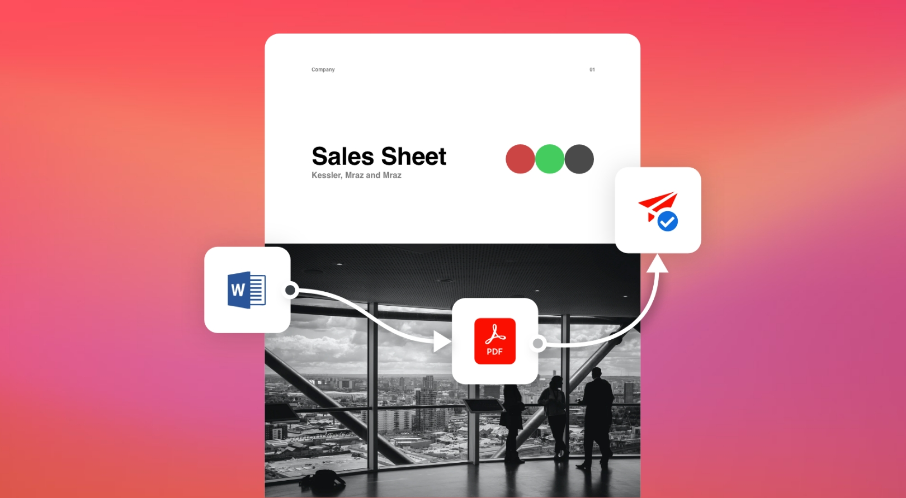
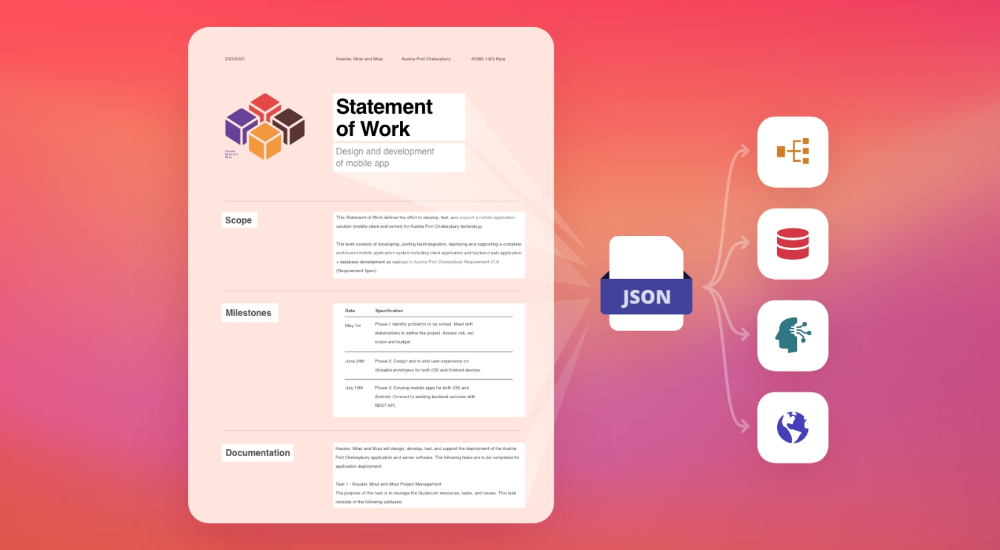
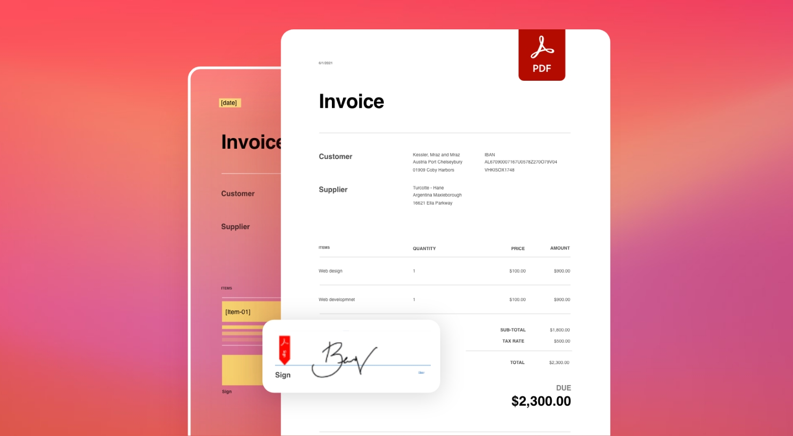
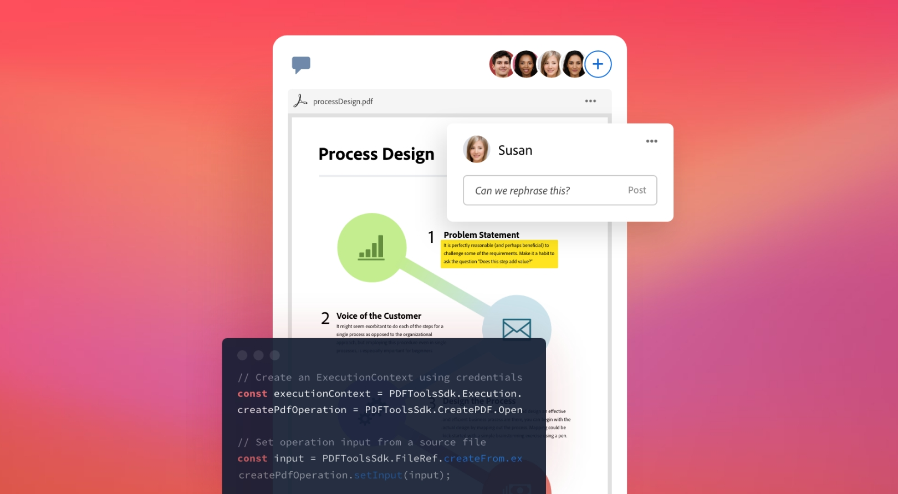

import '../styles/main.css'
import CreatePdfFromUrl from './home/create-pdf-from-url.md';
import DynamicPdfDocumentGeneration from './home/dynamic-pdf-document-generation.md';
import ExtractPdfContentStructure from './home/pdf-content-structure.md';
import EmbedPdfViewingAnalytics from './home/embed-pdf-viewing-analytics.md';
import HomeResourceCard from './home/home-resource.md';
import WhyDocument from './home/why-document.md';
import HomeCarousel from './home/home-carousel.md'
import CustomerStory from './home/home-storyies.md'
import {APIPixelRetargeting} from '../components/retargetting'
import EsealApiAnnouncement from './apis/e-seal-api-announcement.md'

<Hero slots="heading, text, buttons, assetsImg" customLayout variant="video" className="homeherobgImage Hero-Banner"/>

# Reimagine document experiences with PDF APIs designed for developers

From the company who created the PDF standard.

- [Get started](/document-services/apis/interstitial/)

homeheroAssertImage

<AnnouncementBlock slots="heading, text, button" className='ms-announcement-blade' theme="dark"/>

### Join the Beta program for our new Adobe PDF Electronic Seal API

Sign up for the opportunity to try our latest API that helps you verify the identity and integrity of documents using an electronic seal.

[Register now](src/pages/pricing/contact/sales/seal)

<TextBlock slots="image, heading,subHeading,text,buttons" theme="lightest" headerElementType="h2" homeZigZag className="home-zigzag-comp-padding Adobe-PDF-Services-API"/>

### Adobe PDF Services API

### Create, transform, OCR PDFs, and more.

PDF Services API is a collection of multiple services capable of quickly solving specific challenges and
powering multi-step document workflows using SDKs for Node.js, Java, and .Net. With it, you gain
access to basic PDF services, such as creating, securing, compressing, converting, combining, and
splitting PDFs, as well as more advanced services, including Document Generation and PDF Extract.
Do more with this API.

- [Learn more](/src/pages/apis/pdf-services.md)

<TextBlock slots="heading,subHeading,text,buttons,image" theme="light" primaryOutline headerElementType="h2" homeZigZag className="home-zigzag-comp-padding Adobe-PDF-Extract-API" />

### Adobe PDF Extract API

### Unlock content structure in any PDF.

PDF Extract API leverages AI to parse PDFs programmatically and extract data and content for
analysis and processing. Text, images, tables, font styling, and more are extracted with relative
positioning and natural reading order and placed into a structured JSON file for downstream
processing in NLP, RPA, content republishing or data analysis solutions. PDF Extract API works
on both scanned and native PDFs and is included with PDF Services API.

- [Try the demo](https://documentservices.adobe.com/dc-visualizer-app/index.html)
- [Learn more](/src/pages/apis/pdf-extract.md)

<TextBlock slots="image,heading,subHeading,text,buttons" theme="lightest"  primaryOutline headerElementType="h2" homeZigZag className="home-zigzag-comp-padding Adobe-Document-Generation-API"/>

### Adobe Document Generation API

### Generate documents from Word templates and JSON data.

Effortlessly create contracts, agreements, invoices, sales proposals, and more with Document
Generation API. Using Microsoft Word templates and your own data, you can produce
dynamic documents with conditional text, images, lists, and tables. Signature workflows are
a cinch with the Adobe Acrobat Sign integration, and Document Generation is included with PDF
Services API.

- [Try the demo](https://documentservices.adobe.com/dc-docgen-playground/index.html)
- [Learn more](/src/pages/apis/doc-generation.md)

<TextBlock slots="heading,subHeading,text,buttons,image" theme="light"  primaryOutline headerElementType="h2" homeZigZag className="home-zigzag-comp-padding Adobe-PDF-Embed-API"/>

### Adobe PDF Embed API

### Display PDFs and enable collaboration with this free tool.

Leverage our free JavaScript API to embed PDFs and eliminate the need for end users to
download additional plugins when opening PDFs in your applications. With PDF Embed API, you
can provide a rich PDF viewing experience and enable digital collaboration and document
analytics for helpful user insights. Implement this API in minutes with a few lines of code and
samples for Angular and React.

- [Try the demo](https://documentservices.adobe.com/view-sdk-demo/index.html)
- [Learn more](/src/pages/apis/pdf-embed.md)

<SummaryBlock slots="heading, text, buttons"  background="rgb(31, 42, 73)" buttonPositionRight className="Designed-for-developers" />

## Designed for developers

Use our cloud-based REST APIs and SDKs designed for developers to build new, innovative document solutions. Pick and choose from over 15 different PDF and document manipulation APIs to build custom end-to-end agreements, content publishing, data analysis workflow experiences, and more. Get started in minutes with our SDKs for Node.js, .Net, Java, and sample Postman collection.

- [Start free trial](/apis/interstitial/)

<TabsBlock orientation="vertical" slots="heading, image, content" APIReference = "https://developer.adobe.com/document-services/docs/apis/"  repeat="4"  theme="dark" className='bgBlue code-block-0 Designed-for-developers  home-code-block' />

### Create PDF from Word

<CreatePdfFromUrl/>

### Dynamic PDF Document Generation

<DynamicPdfDocumentGeneration/>

### Extract PDF Content & Structure

<ExtractPdfContentStructure/>

### Embed PDF for viewing and analytics

<EmbedPdfViewingAnalytics/>

<WrapperComponent slots="content" theme="lightest" className="why-docment-services"/>

<WhyDocument />

<WrapperComponent slots="content" repeat="1" theme="light" className="Use-cases-for-Adobe-Document-Services"/>

<HomeResourceCard />

<TextBlock slots="buttons" isCentered theme="light"  className='padding-5 Use-cases-for-Adobe-Document-Services'/>

- [View all use cases](/src/pages/use-cases/agreements-and-contracts/sales-proposals-and-contracts/)

<WrapperComponent slots="content" repeat="1" theme="lightest" className="Customer-Stories"/>

<CustomerStory />

<WrapperComponent slots="content" repeat="1" theme="light"/>

<HomeCarousel />

<SummaryBlock slots="image, heading, text, buttons" theme="lightest" background="white" className="How-to-get-started"/>

### How to get started?

Start free trial with 1,000 PDF transactions for up to 6 months.

- [Start free trial](/apis/interstitial/)
- [Contact us](src/pages/pricing/contact.md)

<APIPixelRetargeting/>
