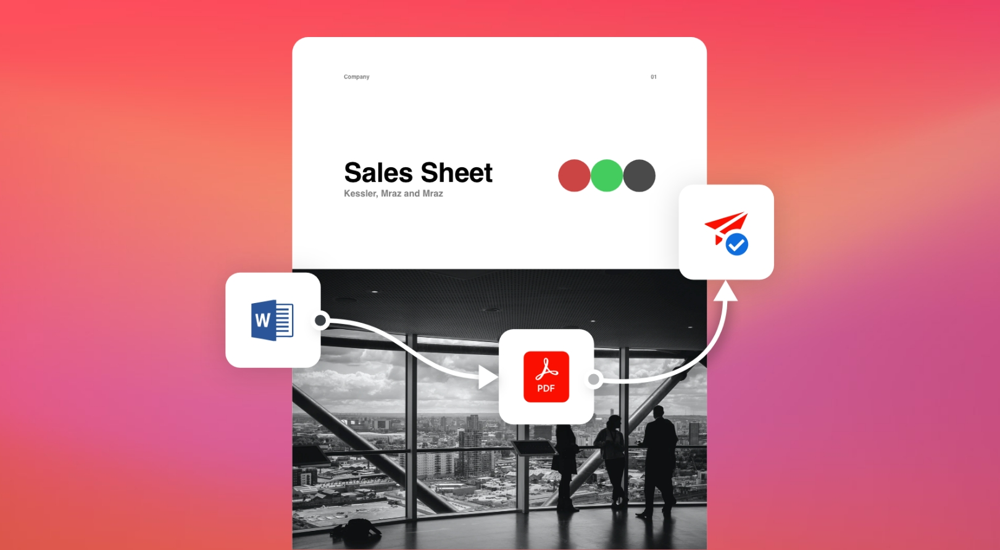
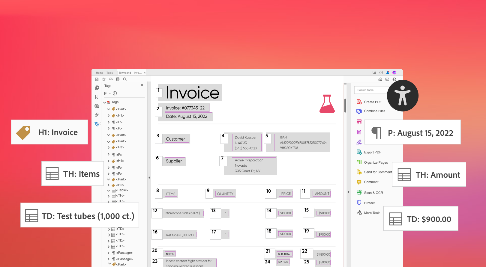
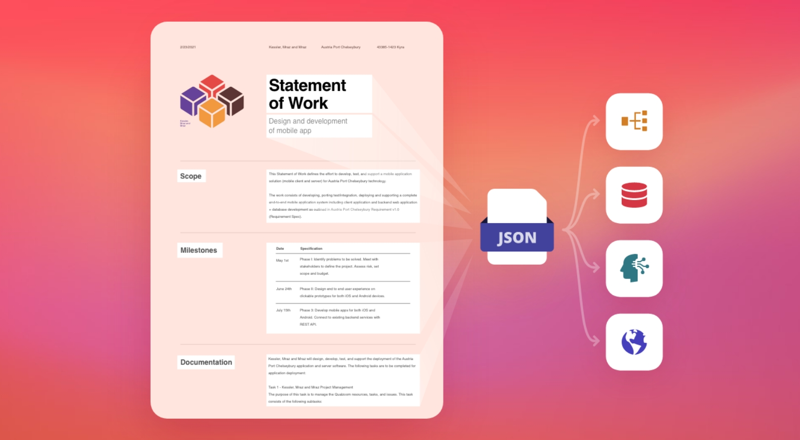
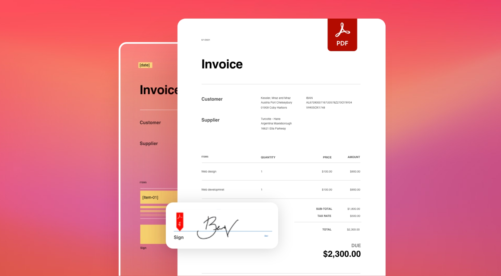
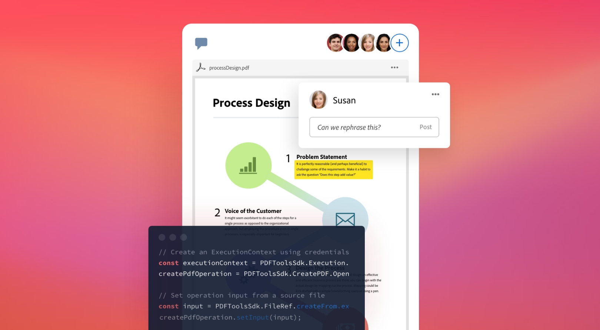
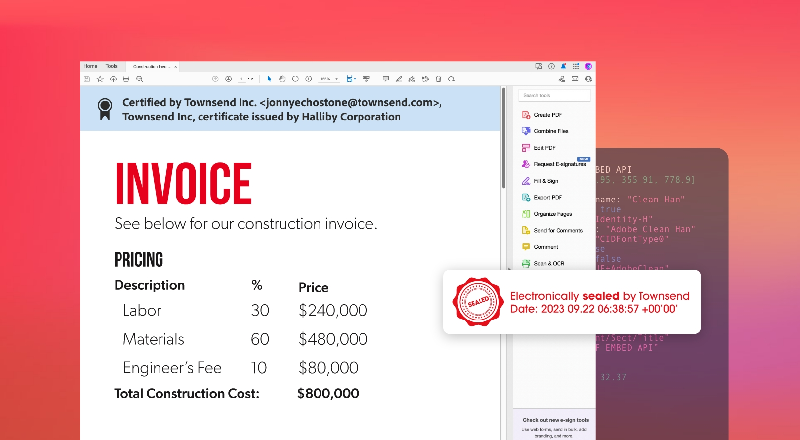

import '../styles/main.css'
import CreatePdfFromUrl from './home/create-pdf-from-url.md';
import AccessibilityAutoTagApi from './home/accessbility-auto-tag.md'
import DynamicPdfDocumentGeneration from './home/dynamic-pdf-document-generation.md';
import ExtractPdfContentStructure from './home/pdf-content-structure.md';
import EmbedPdfViewingAnalytics from './home/embed-pdf-viewing-analytics.md';
import WhyDocument from './home/why-document.md';
import HomeCarousel from './home/home-carousel.md'
import CustomerStory from './home/home-storyies.md'
import {APIPixelRetargeting} from '../components/retargetting'
import EsealApiAnnouncement from './apis/e-seal-api-announcement.md'
import AnimationVideo from "./videos/Adobe_DCP_Marquee_Animation.json";
import ESealAPI from './home/e-seal.md'

<Hero slots="heading, text, buttons, assetsImg" customLayout variant="video" animationVideo={AnimationVideo} className="homeherobgImage Hero-Banner"/>

# Reimagine document experiences with PDF APIs designed for developers

From the company who created the PDF standard.

- [Get started](https://acrobatservices.adobe.com/dc-integration-creation-app-cdn/main.html)

homeheroAssertImage

<TextBlock slots="image, heading,subHeading,text,buttons" theme="lightest" headerElementType="h2" homeZigZag className="home-zigzag-comp-padding Adobe-PDF-Services-API"/>

### Adobe PDF Services API

### Create, transform, OCR PDFs, and more.

PDF Services API is a collection of multiple services capable of quickly solving specific challenges and
powering multi-step document workflows using SDKs for Node.js, Java, and .Net. With it, you gain
access to basic PDF services, such as creating, securing, compressing, converting, combining, and
splitting PDFs, as well as more advanced services, including Document Generation and PDF Extract.
Do more with this API.

- [Learn more](/src/pages/apis/pdf-services.md)

<TextBlock slots="heading,subHeading,text,buttons,image" theme="light" primaryOutline headerElementType="h2" homeZigZag className="home-zigzag-comp-padding Adobe-PDF-Accessibility"/>

### Adobe PDF Accessibility APIs

### Create and evaluate accessible PDFs at scale.

Use the Auto-Tag API to automatically tag tables, paragraphs, lists, headings, and more, and establish a logical reading order for native or scanned PDFs. Use the Checker API to evaluate PDFs and generate actionable reports showing which checks passed, failed, or require manual review.

- [Try the demo](https://acrobatservices.adobe.com/dc-accessibility-playground/main.html)
- [Learn more](/src/pages/apis/pdf-accessibility-apis)

<TextBlock slots="image,heading,subHeading,text,buttons" theme="lightest" primaryOutline headerElementType="h2" homeZigZag className="home-zigzag-comp-padding Adobe-PDF-Extract-API" />

### Adobe PDF Extract API: JSON and Markdown

### Transform PDFs into structured JSON or LLM-ready Markdown.

PDF Extract provides two output formats through separate endpoints powered by the same Adobe extraction technology. Use the Extract PDF endpoint to extract text, tables, figures, styling, and positioning as structured JSON, with tables and figures also available as CSV, XLSX, and PNG files. Use the PDF to Markdown endpoint to convert PDF content into clean, well-structured Markdown that preserves document structure and reading order.

- [Try the demo](https://acrobatservices.adobe.com/dc-visualizer-app/index.html)
- [Learn more](/src/pages/apis/pdf-extract.md)

<TextBlock slots="heading,subHeading,text,buttons,image" theme="light" primaryOutline headerElementType="h2" homeZigZag className="home-zigzag-comp-padding Adobe-Document-Generation-API"/>

### Adobe Document Generation API

### Generate documents from Word templates and JSON data.

Effortlessly create contracts, agreements, invoices, sales proposals, and more with Document
Generation API. Using Microsoft Word templates and your own data, you can produce
dynamic documents with conditional text, images, lists, and tables. Signature workflows are
a cinch with the Adobe Acrobat Sign integration, and Document Generation is included with PDF
Services API.

- [Try the demo](https://acrobatservices.adobe.com/dc-docgen-playground/index.html)
- [Learn more](/src/pages/apis/doc-generation.md)

<TextBlock slots="image,heading,subHeading,text,buttons" theme="lightest" primaryOutline headerElementType="h2" homeZigZag className="home-zigzag-comp-padding Adobe-PDF-Embed-API"/>

### Adobe PDF Embed API

### Display PDFs and enable collaboration with this free tool.

Leverage our free JavaScript API to embed PDFs and eliminate the need for end users to
download additional plugins when opening PDFs in your applications. With PDF Embed API, you
can provide a rich PDF viewing experience and enable digital collaboration and document
analytics for helpful user insights. Implement this API in minutes with a few lines of code and
samples for Angular and React.

- [Try the demo](https://acrobatservices.adobe.com/view-sdk-demo/index.html)
- [Learn more](/src/pages/apis/pdf-embed.md)

<TextBlock slots="heading,subHeading,text,buttons,image" theme="light" primaryOutline headerElementType="h2" homeZigZag className="home-zigzag-comp-padding e-seal-api linking"/>

### Adobe PDF Electronic Seal API

### Apply an electronic seal to documents at scale easily.

Apply an electronic seal to documents at scale using a certificate issued by certain TSPs (Trust Service Providers) on [Adobe’s Approved Trust List (AATL)](https://helpx.adobe.com/acrobat/kb/approved-trust-list1.html). The electronic seal helps verify the identity and integrity of documents. This can be used to e-seal documents at scale and is included with PDF Services API.

- [Try the demo](https://acrobatservices.adobe.com/dc-eseal-playground/index.html#/)
- [Learn more](https://developer.adobe.com/document-services/docs/overview/pdf-electronic-seal-api/)

<TabsBlock orientation="vertical" slots="heading, image, content" APIReference = "https://developer.adobe.com/document-services/docs/overview/"  repeat="6"  theme="dark" className='bgBlue code-block-0 Designed-for-developers  home-code-block tabBlockAlign'/>

### Create PDF from Word

<CreatePdfFromUrl/>

### Auto-tag PDF

<AccessibilityAutoTagApi/>

### Extract PDF Content & Structure

<ExtractPdfContentStructure/>

### Dynamic PDF Document Generation

<DynamicPdfDocumentGeneration/>

### Embed PDF for viewing and analytics

<EmbedPdfViewingAnalytics/>

### E-seal API

<ESealAPI/>

<WrapperComponent slots="content" theme="lightest" className="why-docment-services"/>

<WhyDocument />

<WrapperComponent slots="content" repeat="1" theme="lightest" className="Customer-Stories"/>

<CustomerStory />

<WrapperComponent slots="content" repeat="1" theme="light"/>

<HomeCarousel />

<DCSummaryBlock slots="image, heading, text, buttons" theme="lightest" background="white" variantsTypePrimary="accent"  variantsTypeSecondary="secondary" className="How-to-get-started"/>

### How to get started?

Start with the Free Tier and get 500 free Document Transactions per month.

- [Start for free](https://acrobatservices.adobe.com/dc-integration-creation-app-cdn/main.html)
- [Contact us](src/pages/pricing/contact.md)

<APIPixelRetargeting/>
