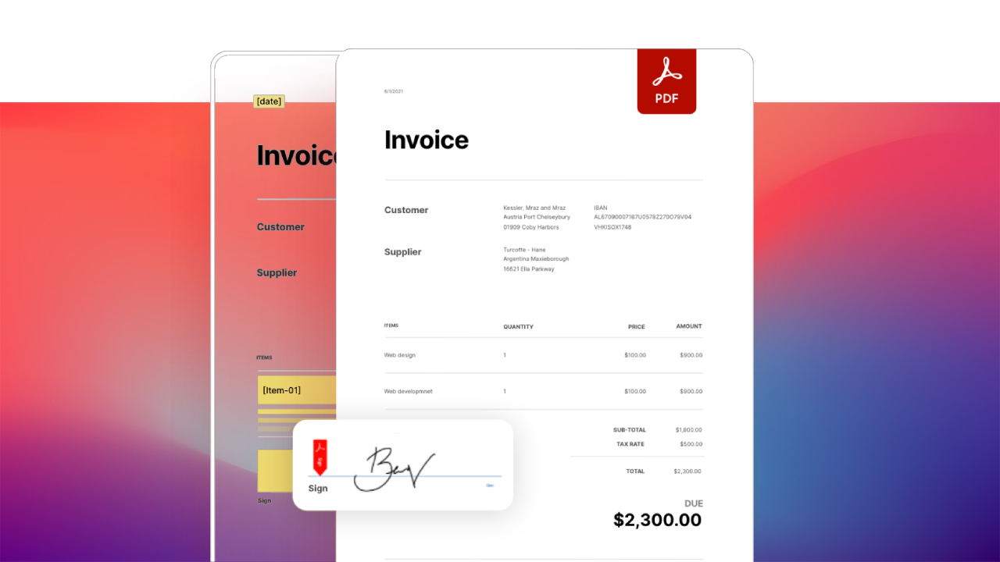

import '../styles/main.css'
import CreatePdfFromUrl from './home/create-pdf-from-url.md';
import DynamicPdfDocumentGeneration from './home/dynamic-pdf-document-generation.md';
import ExtractPdfContentStructure from './home/pdf-content-structure.md';
import EmbedPdfViewingAnalytics from './home/embed-pdf-viewing-analytics.md';
import HomeResourceCard from './home/home-resource.md';
import WhyDocument from './home/why-document.md';
import HomeCarousel from './home/home-carousel.md'
import CustomerStory from './resources/storyies.md'

<Hero slots="heading, text, assetsImg, buttons" customLayout variant="fullwidth" className="homeherobgImage"/>

# Reimagine document experiences with PDF APIs designed for developers

From the company who created the PDF standard.

doc-services-hero

- [Get started](/src/pages/gettingstarted.md)

<TextBlock slots="image, heading,subHeading,text,buttons" theme="lightest" headerElementType="h2" className="home-zigzag-comp-padding"/>

### Adobe PDF Services API
### Create, transform, OCR PDFs, and more

PDF Services API is a collection of multiple services capable of quickly solving specific challenges and powering multi-step document workflows using SDKs for Node.js, Java, and .Net. With it, you gain access to basic PDF services, such as creating, securing, compressing, converting, combining, and splitting PDFs, as well as more advanced services,including Document Generation and PDF Extract. Do more with this API.

- [Learn more](./pdf-services.md)

<TextBlock slots="heading,subHeading,text,buttons,image" theme="light" headerElementType="h2" className="home-zigzag-comp-padding"/>

### Adobe PDF Extract API
### Unlock content structure in any PDF

Leverage the free javascript API to embed PDFs without the need for end users to download additional plugins. Provide a rich PDF viewing and easily enable digital collaboration and document analytics.

- [Learn more](./pdf-extract.md)

<TextBlock slots="image,heading,subHeading,text,buttons" theme="lightest"  headerElementType="h2" className="home-zigzag-comp-padding"/>

### Adobe Document Generation API
### Generate documents from Word templates and JSON data

Use the PDF Tools API to quickly solve specific challenges or power multi-step document workflows, with SDKs for Node.js, Java and .Net. Apply OCR to enable searching, easil convert files(HTML to PDF, PDF to Microsoft Word and more), or combine actions to automate workflows.

- [Learn more](doc-generation.md)
- [Demo](https://adobe.com/go/dcdocgen_api_demo)

<TextBlock slots="heading,subHeading,text,buttons,image" theme="light"  headerElementType="h2" className="home-zigzag-comp-padding"/>

### Adobe PDF Embed API
### Display PDFs and enable collaboration with this free API

Leverage our free javascript API to embed PDFs without the need for end users to download additional plugins. Provide rich PDF viewing and easily enable digital collaboration and document analytics.

- [Learn more](./pdf-embed.md)
- [Demo](https://www.adobe.com/go/pdfEmbedAPI_demo)

<SummaryBlock slots="heading, text, buttons"  background="rgb(31, 42, 73)" buttonPositionRight />

## Designed for developers

Use our cloud-based REST APIs and SDKs designed for developers to build new, innovative document solutions. Pick and choose from over 15 different PDF and document manipulation APIs to build custom end-to-end agreements, content publishing, data analysis workflow experiences, and more. Get started in minutes with our SDKs for Node.js, .Net, Java, and sample Postman collection.

- [Start free trial](https://dc.stage.acrobat.com/dc-integration-creation-app-cdn/index.html)

<TabsBlock orientation="vertical" slots="heading, image, content" APIReference = "https://www.adobe.com/go/dcsdk_APIdocs"  repeat="4"  theme="dark" className='bgBlue code-block-0' />

### Create PDF from URL

<CreatePdfFromUrl/>

### Dynamic PDF Document Generation

<DynamicPdfDocumentGeneration/>

### Extract PDF Content & Structure

<ExtractPdfContentStructure/>

### Embed PDF for viewing and analytics

<EmbedPdfViewingAnalytics/>

<WrapperComponent slots="content" theme="lightest" className="why-docment-services"/>

<WhyDocument />

<WrapperComponent slots="content" repeat="1" theme="light"/>

<HomeResourceCard />

<TextBlock slots="buttons" isCentered theme="light"  className='padding-5'/>

- [View all use cases](/src/pages/use-cases)

<WrapperComponent slots="content" repeat="1" theme="lightest"/>

<CustomerStory />

<WrapperComponent slots="content" repeat="1" theme="light"/>

<HomeCarousel />

<SummaryBlock slots="image, heading, text, buttons" theme="lightest" background="white" />

### How to get started?

Start free trial with 1,000 PDF transactions for up to 6 months.

- [Start free trial](https://dc.stage.acrobat.com/dc-integration-creation-app-cdn/index.html)
- [Contact us](src/pages/pricing/contact-us.md)