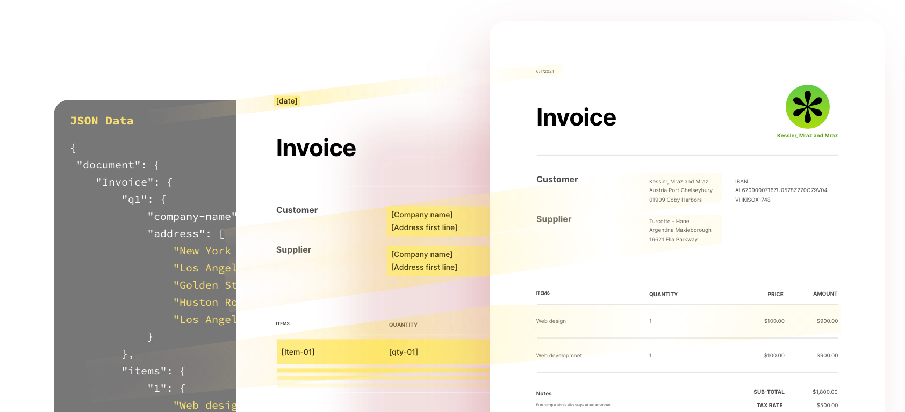

import '../styles/main.css'
import CreatePdfFromUrl from './home/create-pdf-from-url.md';
import DynamicPdfDocumentGeneration from './home/dynamic-pdf-document-generation.md';
import ExtractPdfContentStructure from './home/pdf-content-structure.md';
import EmbedPdfViewingAnalytics from './home/embed-pdf-viewing-analytics.md';
import HomeResourceCard from './home/home-resource.md';
import HomeProduct from './home/home-product.md';
import WhyDocument from './home/why-document.md';
import HomeCarousel from './home/home-carousel.md'

<Hero slots="image, heading, text, assets, buttons" customLayout variant="fullwidth" background="rgb(250, 105, 85)" className="homeHeroAssetImg"/>

# Reimagine document experiences with PDF APIs designed for developers

From the company who created the PDF standard.

- [Try the demo](/src/pages/pdf-extract.md)

<TextBlock slots="image, heading,text,buttons" theme="lightest" />

### PDF APIs with SDKs for Node.js, .Net, and java to create, convert, OCR PDFs, and more

Use the PDF Tools API to quickly solve specific challenges or power multi-step document workflows, with SDKs for Node.js, Java and .Net. Apply OCR to enable searching, easil convert files(HTML to PDF, PDF to Microsoft Word and more), or combine actions to automate workflows.

- [Demo](https://www.adobe.io/apis/documentcloud/dcsdk/pdf-services.html)
- [Learn more](https://www.adobe.io/apis/documentcloud/dcsdk/pdf-services.html)

<TextBlock slots="heading,text,buttons,image" theme="light" />

### Unluck content structure in any PDF for NLP, RPA, and more

Leverage the free javascript API to embed PDFs without the need for end users to download additional plugins. Provide a rich PDF viewing and easily enable digital collaboration and document analytics.

- [Demo](https://www.adobe.io/apis/documentcloud/dcsdk/pdf-extract.html)
- [Learn more](https://www.adobe.io/apis/documentcloud/dcsdk/pdf-extract.html)

<TextBlock slots="image,heading,text,buttons" theme="lightest"  />

### Generate PDF and Word documents from Word templates and JSON data

Use the PDF Tools API to quickly solve specific challenges or power multi-step document workflows, with SDKs for Node.js, Java and .Net. Apply OCR to enable searching, easil convert files(HTML to PDF, PDF to Microsoft Word and more), or combine actions to automate workflows.

- [Demo](https://documentcloud.adobe.com/dc-docgen-playground/index.html#/) 
- [Learn more](https://www.adobe.io/apis/documentcloud/dcsdk/doc-generation.html)

<TextBlock slots="heading,text,buttons,image" theme="light"  />

### PDF Embed API to insert PDFs and enable collaboration in web apps

Leverage the free javascript API to embed PDFs without the need for end users to download additional plugins. Provide a rich PDF viewing and easily enable digital collaboration and document analytics.

- [Demo](https://www.adobe.com/go/pdfEmbedAPI_demo) 
- [Learn more](https://www.adobe.io/apis/documentcloud/dcsdk/pdf-embed.html)

<SummaryBlock slots="heading, text, buttons"  background="rgb(31, 42, 73)" buttonPositionRight />

## Designed for developers

Use our cloud-based REST APIs and SDKs designed for developers to build new, innovative document solutions. Pick and choose from over 15 different PDF and document manipulation APIs to build custom end-to-end agreements, content publishing, data analysis workflow experiences, and more. Get started in minutes with our SDKs for Node.js, .Net, Java, and sample Postman collection.

- [Start free trial](/src/pages/gettingstarted.md)

<TabsBlock orientation="vertical" slots="heading, image, content" APIReference = "https://www.adobe.com/go/dcsdk_APIdocs"  repeat="4"  theme="dark" className='bgBlue code-block-0' />

### Create PDF from URL

<CreatePdfFromUrl/>

### Dynamic PDF Document Generation

<DynamicPdfDocumentGeneration/>

### Extract PDF Content & Structure

<ExtractPdfContentStructure/>

### Embed PDF for viewing and analytics

<EmbedPdfViewingAnalytics/>

<WrapperComponent slots="content" theme="lightest" className="why-docment-services"/>

<WhyDocument />

<WrapperComponent slots="content" repeat="1" theme="light"/>

<HomeResourceCard />

<TextBlock slots="buttons" isCentered theme="light"  className='blade-bottom-content'/>

- [View all Use Case](/src/pages/use-cases)

<WrapperComponent slots="content" repeat="1" theme="lightest"/>

<HomeCarousel />

<WrapperComponent slots="content" repeat="1" theme="light"/>

<HomeProduct />

<SummaryBlock slots="image, heading, text, buttons" theme="lightest" background="white" />

### We're ready to help 

Have questions about the Document Services APIs.

- [Go to the Adobe Forum](/src/pages/gettingstarted.md)
- [Contact us](./contact-us.md)