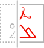

<Hero slots="image, heading, text, buttons" variant="halfwidth" />  

# Adobe PDF Embed API

Free JavaScript API to embed high-fidelity PDFs, enable collaboration, and see analytics

* [Try the demo](https://www.adobe.com/go/pdfEmbedAPI_demo)

<TextBlock slots="image, heading, text" width="33%" theme="light" />

### Accurate, consistent PDF rendering

Whether on dynamic or static pages, deliver the highest quality PDF rendering available

<TextBlock slots="image, heading, text" width="33%" theme="light" />

### Customizable user experience

Choose exactly how to display a PDF and use the callbacks and annotations APIs to provide programmatic control and enable digital collaboration

<TextBlock slots="image, heading, text" width="33%" theme="light" />

### Analytics on PDF usage

Use analytics to understand how users interact with PDFs, including time spent on a page and searches

<TextBlock slots="buttons" isCentered theme="light"/>

* [Get Free Credentials](/src/pages/gettingstarted.md)

<TitleBlock slots="heading" theme="lightest" />

## Key Features of Our free PDF Embed API

<TextBlock slots="image, heading, text" width="33%" theme="lightest" />

### Embed modes

Control how you embed PDFs, with support for full-sized windows, sized containers, in-line display, and lightboxes

<TextBlock slots="image, heading, text" width="33%" theme="lightest" />

### Annotations

Full support for import, create, delete, update, exporting of comments, and more; programmatically add, update, and delete annotations with the option to save; events can be triggered based on user actions

<TextBlock slots="image, heading, text" width="33%" theme="lightest" />

### PDF Analytics

Easily integrate Adobe Analytics with only a few steps, or leverage the user events to push data to other analytics tools

<TextBlock slots="image, heading, text" width="33%" theme="lightest" />

### Collaborative Settings

For multi-user document collaboration, identify reviewers by name or email address and save annotation settings through custom callbacks (default settings display GUEST as the reviewer name for all comments)

<TextBlock slots="image, heading, text" width="33%" theme="lightest" />

### Save controls

Support auto-save to local drives or external storage, with options for frequency and polling, along with success/fail events capture; use file modification and status polling events for multi-user workflows

<TextBlock slots="image, heading, text" width="33%" theme="lightest" />

### Menu & Tool Options

Programmatically enable or disable the left-hand panel, comments pane, toolbars, print, and download options

<TextBlock slots="buttons" isCentered />

* [See Documentation](https://www.adobe.com/go/pdfembedapi_docs)

<TitleBlock slots="heading, text" theme="light" />

## Start Embedding PDFs in Minutes

Start your free 6-month trial today with 1,000 PDF transactions

<TextBlock slots="heading, text, buttons" width="33%" theme="light" />

### Step 1

Obtain free credentials

* [Get started](/src/pages/gettingstarted.md)

<TextBlock slots="heading, text, buttons" width="33%" theme="light" />

### Step 2

Copy JavaScript code or download samples for React and Angular

* [Get JavaScript](https://www.adobe.com/go/pdfembedapi_docs)
* [Get Samples](https://github.com/adobe/pdf-embed-api-samples)

<TextBlock slots="heading, text, buttons" width="33%" theme="light" />

### Step 3

Add credentials to your code and run!

* [See Documentation](https://www.adobe.com/go/pdfembedapi_docs)

<TitleBlock slots="heading" theme="lightest" />

## Integrations

<TextBlock slots="heading, text, links" width="50%" theme="lightest" />

### Adobe Experience Manager

Adobe Experience Manager customers can easily drag and drop a high-fidelity PDF viewer directly into web applications without the need for additional code or customizations. Includes pre-configurable settings for comments, printing, downloading, and integrated Adobe Analytics.

* [Learn more](https://www.aemcomponents.dev/content/core-components-examples/library/page-authoring/pdf-viewer.html)

<TextBlock slots="heading, text, links" width="50%" theme="lightest" />

### Adobe Analytics

Out of the box Adobe Analytics integration allows customers to seamlessly enable rich analytics and gain insights on end user experience. Extend functionality with chatbots or calls to action based on user interactions.

* [Learn more](https://medium.com/adobetech/pdf-analytics-get-insights-onembedded-pdfs-on-your-website-44e6a314fb1f)

<TitleBlock slots="heading" theme="dark" />

## Use Cases for PDF Embed API

<TextBlock slots="image, heading, text, links" width="25%" theme="dark" />

## Student Teacher Collaboration

Accelerate digital learning programs with embedded PDF viewing for teacher and peer document collaboration.

* [See Use Case](/src/pages/use-cases/collaboration/index.md)

<TextBlock slots="image, heading, text, links" width="25%" theme="dark" />

## Reviews and Approvals

Maximize remote worker productivity with multi-user document collaboration including commenting, markup, text edits, and more.

* [See Use Case](/src/pages/use-cases/collaboration/review-and-approval.md)

<TextBlock slots="image, heading, text, links" width="25%" theme="dark" />

## Digital Content Publishing

Publish whitepapers and marketing content with end-user interactivity, security controls, and analytics.

* [See Use Case](/src/pages/use-cases/content-publishing/index.md)

<TextBlock slots="image, heading, text, links" width="25%" theme="dark" />

## Report Creation and Editing

Create and embed reports for internal or external consumption, sharing, and review.

* [See Use Case](/src/pages/use-cases/content-publishing/on-demand-report-creation.md)

<TextBlock slots="buttons" isCentered theme="dark" />

* [See all Use Case](/src/pages/use-cases)

 
<SummaryBlock slots="image, heading, text, buttons" background="rgb(250, 105, 85)" />

### We're ready to help    

Have questions about the Document Services APIs? 

* [Go to the Adobe Forum](https://www.adobe.com/go/pdftoolsapi_forum)
* [Contact us](https://www.adobe.com/go/pdftoolsapi_requestform)

