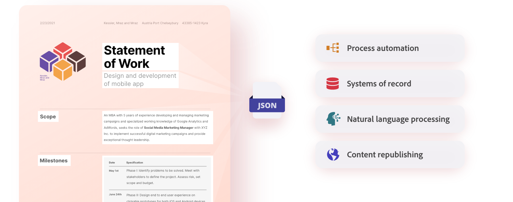
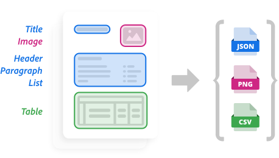
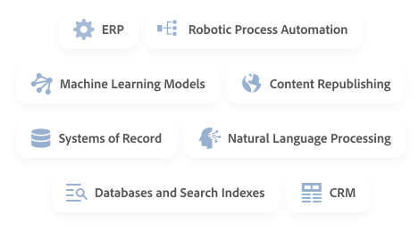

import '../styles/main.scss'
import PdfExtractResource from './pdf-extract/pdf-extract-resource.md';
import ExtractStepperComponent from './pdf-extract/extract-stepper.md';
import WhyExtractAPI from './pdf-extract/why-extract-api.md';
import ExtractProductCard from './pdf-extract/extract-product.md';
import HowItWorks from './pdf-extract/how-it-works.md';

<Hero slots="image, heading, text, assets, buttons" customLayout variant="fullwidth" background="rgb(250, 105, 85)" className="homeHeroAssetImg"/>

# Adobe PDF Extract API

Unlock the structure and content elements of any PDF with a web service powered by Adobe Sensei's machine learning.

- [Try the demo](/src/pages/pdf-extract.md)

<WrapperComponent slots="content" repeat="1" theme="light"/>

<WhyExtractAPI/>

<WrapperComponent slots="content" repeat="1" theme="lightest"/>

<HowItWorks/>

<TextBlock slots="video"  theme="lightest" className="media-horizantal-align mediaSize"/>

[Adobe PDF Extract API Overview](https://www.youtube.com/watch?v=oIG6U_dDHII)

<TextBlock slots="image, text" theme="light" className="padding_top_align media-horizantal-align"/>

Adobe PDF Extract API is powered by [Adobe Sensei](https://www.adobe.com/sensei.html) industry-leading artificial intelligence (AI) and machine learning (ML). The technology enables a rich understanding of documents, such as the identification of elements, including position and connections relative to other elements. In addition, it can determine reading order. These and other capabilities ensure the most comprehensive output of structured content.

<TextBlock slots="image, text" theme="lightest" className="padding_top_align media-horizantal-align"/>

Extracted content is output in a structured JSON file – with tables optionally included as CSV or XLSX files and images saved as PNG files – so developers can easily store, analyze, and manipulate the data in a variety of downstream systems. Examples include databases, systems of record, CRM, ERP, NLP, RPA as well as machine learning models and analytic tools.

<WrapperComponent slots="content" repeat="1" theme="light"/>

<ExtractStepperComponent />

<WrapperComponent slots="content" repeat="1" theme="lightest"/>

<PdfExtractResource/>

<TextBlock slots="buttons" isCentered theme="lightest"  className='blade-bottom-content'/>

- [View all Use Case](/src/pages/use-cases)

<WrapperComponent slots="content" repeat="1" theme="light"/>

<ExtractProductCard/>

<SummaryBlock slots="image, heading, text, buttons" theme="lightest" background="white" />

### We're ready to help 

Have questions about the Document Services APIs.

- [Go to the Adobe Forum](/src/pages/gettingstarted.md)
- [Contact us](https://www.adobe.com/in/creativecloud/business/teams.html)

