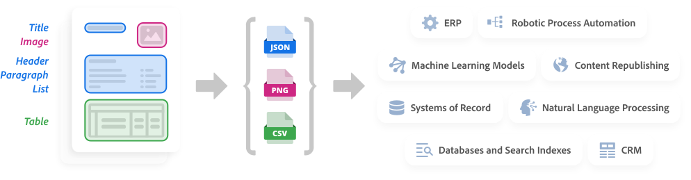

<Hero slots="image, heading, text" variant="fullwidth" background="rgb(250, 105, 85)"/>  

# Adobe PDF Extract API

Unlock the structure and content elements of any PDF with a web service powered by Adobe Sensei's machine learning

<TitleBlock slots="heading" theme="light" />

## Key Features of Adobe PDF Extract API

<TextBlock slots="image, heading, text" width="25%" theme="light" />

### Comprehensive Content Extraction

Extract all PDF document elements including text, tables, and images within a structured JSON file to enable a variety of downstream solutions.

<TextBlock slots="image, heading, text" width="25%" theme="light" />

### Document Structure Understanding

Classify text objects such as headings, lists, footnotes, and paragraphs that may span multiple columns or pages. Capture text fonts and styles, positioning, and the natural reading order of all objects.

<TextBlock slots="image, heading, text" width="25%" theme="light" />

### Highly Accurate Results

Adobe Sensei AI technology delivers highly accurate data extraction across a broad range of document types – both native and scanned PDFs – without requiring custom ML templates or model training.

<TextBlock slots="image, heading, text" width="25%" theme="light" />

### Platform Agnostic

Adobe’s PDF Extract API is RESTful and can be used to seamlessly integrate with any cloud platform or on-premise application.

<TextBlock slots="buttons" isCentered theme="light" />

* [Start free trial](/src/pages/gettingstarted.md)

<TitleBlock slots="heading" theme="dark" />

## Adobe PDF Extract API Use Cases

<TextBlock slots="image, heading, text, links" width="33%" theme="dark" />

### Content Processing

Quickly and accurately extract data and context from native and scanned PDFs to automate downstream processes using technologies like Robotic Process Automation (RPA) and Natural Language Processing (NLP).

* [See Use Case](/src/pages/use-cases/index.md)

<TextBlock slots="image, heading, text, links" width="33%" theme="dark" />

### Data Analysis

Extract data from complex tables including cell data, column and row headers, and table properties for use in machine learning models, analysis, or storage.

* [See Use Case](/src/pages/use-cases/content-and-data-extraction/data-analysis.md)

<TextBlock slots="image, heading, text, links" width="33%" theme="dark" />

### Content Republishing

Republish the content in PDF documents across different media, languages, and formats by extracting not just data but also structural context, text and table formatting, and reading order.

* [See Use Case](/src/pages/use-cases/content-publishing/index.md)

<TextBlock slots="buttons" isCentered theme="dark" />

* [See all Use Cases](/src/pages/use-cases)

<TitleBlock slots="heading, text" theme="light" />

## How it works

Advanced machine learning and artificial intelligence parse complex document content for reuse in a variety of critical downstream processes

<TextBlock slots="video, buttons" isCentered theme="light"/>

[Adobe PDF Extract API Overview](https://www.youtube.com/watch?v=oIG6U_dDHII)

* [Download JSON samples](https://adobe.com/go/dcExtract_sample)

<TextBlock slots="image, text1, text2" theme="light" />

Adobe PDF Extract API is powered by [Adobe Sensei](https://www.adobe.com/sensei.html) industry-leading artificial intelligence (AI) and machine learning (ML). The technology enables a rich understanding of documents, such as the identification of elements, including position and connections relative to other elements. In addition, it can determine reading order. These and other capabilities ensure the most comprehensive output of structured content.

Extracted content is output in a structured JSON file – with tables optionally included as CSV or XLSX files and images saved as PNG files – so developers can easily store, analyze, and manipulate the data in a variety of downstream systems. Examples include databases, systems of record, CRM, ERP, NLP, RPA as well as machine learning models and analytic tools.

<TitleBlock slots="heading, text" theme="lightest" />

## Get started in minutes

Start your 6-month trial today with 1,000 free PDF transactions

<TextBlock slots="heading, text, buttons" width="33%" theme="lightest" />

### Step 1

Obtain free credentials

* [Start free trial](/src/pages/gettingstarted.md)

<TextBlock slots="heading, text" width="33%" theme="lightest" />

### Step 2

Download ready to run samples for [Node.js](https://adobe.com/go/dcExtract_node_sdk), [Java](https://adobe.com/go/dcExtract_java_sdk), and [Python](https://adobe.com/go/dcExtract_python_sdk)

<TextBlock slots="heading, text, buttons" width="33%" theme="lightest" />

### Step 3

Add credentials to your code and experience the power of the API.

* [See documentation](https://adobe.com/go/dcExtract_overview_doc)
* [See API Reference](https://www.adobe.com/go/dcsdk_APIdocs)

 
<SummaryBlock slots="image, heading, text, buttons" background="rgb(250, 105, 85)" />

### We're ready to help    

Have questions about the Document Services APIs? 

* [Go to the Adobe Forum](https://www.adobe.com/go/pdftoolsapi_forum)
* [Contact us](https://www.adobe.com/go/pdftoolsapi_requestform)