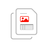

<TitleBlock slots="heading" theme="light" className='titleBlock-align-left'/>

## Explore other adobe document cloud services

<ProductCard slots="icon, heading, text, buttons" theme="light" width="33%" className="product-card-compact-img product-card-compact-img-service"/>

#### Services

Create a PDF from Microsoft Office documents, protect the content, and export to other formats

* [Learn more](/src/pages/pdf-services.md)

<ProductCard slots="icon, heading, text, buttons" theme="light" width="33%" className="product-card-compact-img product-card-compact-img-service"/>

#### Generate

Generate PDF and Word documents from custom Word templates

* [Learn more](/src/pages/doc-generation.md)
* [Demo](https://documentcloud.adobe.com/dc-docgen-playground/index.html#/)

<ProductCard slots="icon, heading, text, buttons" theme="light" width="33%" className="product-card-compact-img product-card-compact-img-service"/>

#### Embed

Embed high-fidelity PDFs in web apps with analytics

* [Learn more](/src/pages/pdf-embed.md)
* [Demo](https://documentcloud.adobe.com/view-sdk-demo/index.html#/view/FULL_WINDOW/Bodea%20Brochure.pdf)