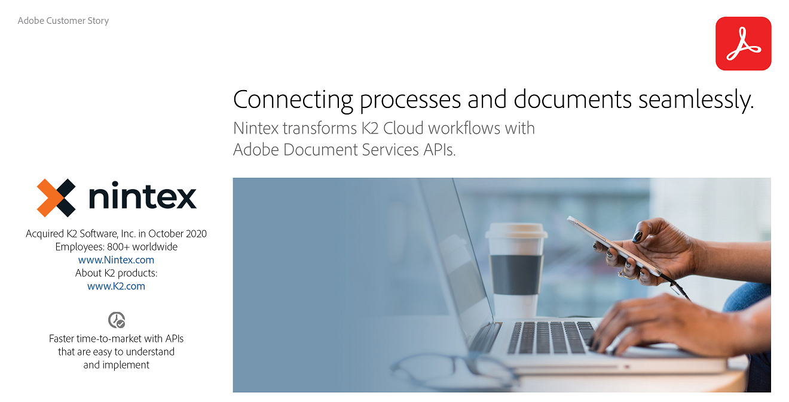

<Hero slots="image, heading, text" variant="halfwidth" />  

# Developer Resources

Start integrating our APIs into your solutions

<TextBlock slots="image, heading, text, buttons" theme="light"/>

### Using Adobe PDF Services API to OCR PDF Files

With OCR (Optical Character Recognition) you can unlock scanned PDFs to extract text and create searchable files

* [Read more](https://experienceleague.adobe.com/docs/document-services/tutorials/pdfservices/ocr.html)
 

<TitleBlock slots="heading, text" theme="lightest"/>

## Tutorials 

Find tutorials from novice to expert to help you expand your skills.

<TextBlock slots="buttons" isCentered theme="lightest"/>

* [All tutorials](https://experienceleague.adobe.com/docs/document-services/document-services/overview.html)

<TitleBlock slots="heading" theme="lightest" />

## Blog

<ResourceCard slots="link, image, heading, text" width="33%" theme="lightest" />

[medium.com](https://medium.com/adobetech/adobe-pdf-extract-api-output-demystified-ff69841c4ed3?source=rss----9342990108af--adobe_document_cloud)

### Adobe PDF Extract: API Output Demystified

Since PDF’s invention, getting text out of a PDF file, in the correct reading order, from any PDF, including tabular data.

<ResourceCard slots="link, image, heading, text" width="33%" theme="lightest" />

[medium.com](https://medium.com/adobetech/generating-and-protecting-invoices-with-adobe-document-generation-and-pdf-services-1ba1edd7f7df?source=rss----9342990108af--adobe_document_cloud)

### Generating and Protecting Invoices with Adobe Document Generation and PDF Services

Adobe Document Services platform continues to build and expand what’s available.

<ResourceCard slots="link, image, heading, text" width="33%" theme="lightest" />

[medium.com](https://medium.com/adobetech/unpacking-june-2021-release-adobe-document-services-c1ff57e3e607?source=rss----9342990108af--adobe_document_cloud)

### Unpacking June 2021 Release: Adobe Document Services

New features in June 2021 added to Adobe Document Services like PDF Extract and Document Generation for Microsoft Power Automate.

<TitleBlock slots="heading, text" theme="lightest" />

## Customer Stories

See how our customers are building great experiences and succeeding with Adobe

<ResourceCard slots="link, image, heading" width="50%" theme="lightest" />

[K2Nintext.pdf](resources/K2Nintex.pdf)

### Nintex transforms K2 Cloud workflows with Adobe Document Services APIs

<ResourceCard slots="link, image, heading" width="50%" theme="lightest" />

[AdobeInDesign.pdf](resources/AdobeInDesign.pdf)

### Adobe InDesign brings its new Share for Review features to life with Adobe Document Services APIs

<ResourceCard slots="link, image, heading" width="50%" theme="lightest" />

[Cambridge-Assessment.pdf](resources/Cambridge-Assessment.pdf)

### Cambridge Assessment intends to digitize more than 100 years of test material with Adobe PDF Extract API.

<ResourceCard slots="link, image, heading" width="50%" theme="lightest" />

[Evisort.pdf](resources/Evisort.pdf)

### Evisort uses Adobe PDF Extract API to bring visibility and intelligence to contracts.

<SummaryBlock slots="image, heading, text, buttons" background="rgb(250, 105, 85)" />

### We're ready to help    

Have questions about the Document Cloud SDKs? 

* [Go to the Adobe Forum](https://www.adobe.com/go/pdftoolsapi_forum)
* [Contact us](https://www.adobe.com/go/pdftoolsapi_requestform) 