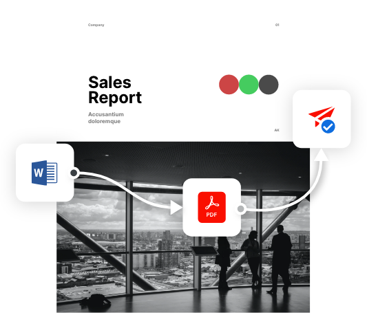

import WhyPDFServicesAPI from './pdf-services/why-pdf-services-api.md';
import KeyFeaturesCodeBlock from './pdf-services/key-features-code-block.md';
import AWSMSCarousel from './pdf-services/aws-ms-carousel.md';
import StartModifyingPDF from './pdf-services/start-modifying-pdf.md';
import UseCasesResourceCard from './pdf-services/use-cases-resource-cards.md';
import DocumentServicesProductCards from './pdf-services/document-services-product-cards.md';
import AdobePDFExtractAPI from './pdf-services/adobe-pdf-extract-api.md';

<Hero slots="heading, text, assets, buttons" customLayout variant="fullwidth" className="herobgImage homeHeroAssetImg"/>

# Adobe PDF Services API

Create, convert, transform, OCR PDFs and more

- [Try the demo](/src/pages/pdf-services.md)

<!-- Why PDF Services API -->
<WrapperComponent slots="content" repeat="1" theme="lightest" className="why-pdf-services"/>

<WhyPDFServicesAPI />

<!-- Carousel Block -->
<!-- <WrapperComponent slots="content" repeat="1" theme="dark"/> -->

<AWSMSCarousel />

<!-- Key Features Code Block -->

<KeyFeaturesCodeBlock />

<!--Adobe PDF Extract API -->

<WrapperComponent slots="content" repeat="1" theme="lightest"/>

<AdobePDFExtractAPI />

<!--Stepper Block -->

<WrapperComponent slots="content" repeat="1" theme="light"/>

<StartModifyingPDF />

<!--Resource Card Block -->

<WrapperComponent slots="content" repeat="1" theme="lightest"/>

<UseCasesResourceCard />

<TextBlock slots="buttons" isCentered theme="lightest"  className='blade-bottom-content padding-top-zero'/>

- [View all Use Case](/src/pages/use-cases)

<WrapperComponent slots="content" repeat="1" theme="light"/>

<DocumentServicesProductCards />

<SummaryBlock slots="image, heading, text, buttons" theme="lightest" background="white" />

## We're ready to help

Have questions about the Document Services APIs?

- [Go to the Adobe Forum](/src/pages/gettingstarted.md)
- [Contact us](./contact-us.md)