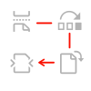
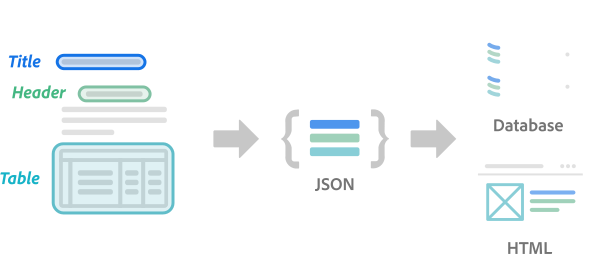

<Hero slots="image, heading, text, buttons" variant="halfwidth"/>  

# Adobe PDF Services API

PDF APIs with SDKs for Node.js, .Net, and Java to create, convert, OCR PDFs, and more. 

* [Contact Us](https://www.adobe.com/go/pdftoolsapi_requestform)

<TextBlock slots="image, heading, text" width="33%" theme="light" />

### Create, secure, and export PDF documents

Create a PDF from Microsoft Office documents, protect the content, and export to other formats

<TextBlock slots="image, heading, text" width="33%" theme="light" />

### Modify PDFs and optimize output

Programmatically alter a document, such as reordering, inserting, and rotating pages, as well as compressing the file

<TextBlock slots="image, heading, text" width="33%" theme="light" />

### Leverage Adobe's cloud-based services

Access the same cloud-based APIs that power Adobe's end user applications to quickly deliver scalable, [secure](https://www.adobe.com/content/dam/cc/en/security/pdfs/AdobeDocumentServices_SecurityOverview.pdf) solutions

<TextBlock slots="buttons" isCentered theme="light"/>

* [Start free trial](/src/pages/gettingstarted.md)

<TextBlock slots="image" theme="darkest" width="50%" theme="dark" />

<TextBlock slots="image" theme="darkest" width="50%" theme="dark" />

<TextBlock slots="heading, text, buttons" isCentered theme="dark"/>

### AWS Marketplace Partnership

We now offer all of our PDF Services APIs for purchase as a subscription in AWS console

* [Learn more](/src/pages/pdf-pricing.md)

<TextBlock slots="image" theme="darkest" width="50%" theme="darkest" />

<TextBlock slots="image" theme="darkest" width="50%" theme="darkest" />

<TextBlock slots="heading, text, buttons" isCentered theme="darkest"/>

### Microsoft Power Automate Integration

Quickly automate document processes without writing any code using the new Adobe PDF Services Connector.

* [Learn more](https://helpx.adobe.com/document-cloud/help/pdf-connector-for-microsoft-power-automate.html) 

<TitleBlock slots="heading" theme="lightest" />

## Key Features of Adobe PDF Services API

<TextBlock slots="image, heading, text, links" width="25%" theme="lightest" />

### Extract PDF Content

Extract text, images, tables, and more from native and scanned PDFs into a structured JSON file. PDF Extract API leverages AI technology to accurately identify text objects and understand the natural reading order of different elements such as headings, lists, and paragraphs spanning multiple columns or pages. Extract font styles with identification of metadata such as bold and italic text and their position within your PDF. Extracted content is output in a structured JSON file format with tables in CSV or XLSX and images saved as PNG.

* [See Documentation](https://www.adobe.com/go/pdftoolsapi_doc)

<TextBlock slots="image, heading, text, links" width="25%" theme="lightest" />

### Create PDF

Create PDFs from a variety of formats, including static and dynamic HTML; Microsoft Word, PowerPoint, and Excel; as well as text, image, and, Zip
Support for HTML to PDF, DOC to PDF, DOCX to PDF, PPT to PDF, PPTX to PDF, XLS to PDF, XLSX to PDF, TXT to PDF, RTF to PDF, BMP to PDF, JPEG to PDF, GIF to PDF, TIFF to PDF, PNG to PDF

* [See API Reference](https://www.adobe.com/go/dcsdk_APIdocs#post-createPDF)

<TextBlock slots="image, heading, text, links" width="25%" theme="lightest" />

### Document Generation

Generate PDF or Word documents from Microsoft Word templates and your data. Merge dynamic data with your custom templates to generate on brand contracts, proposals, invoices, NDAs, and more.
Use our Word add-in to quickly create templates and add signatures with out of the box Adobe Sign integration.

* [Learn more](/src/pages/doc-generation.md)

<TextBlock slots="image, heading, text, links" width="25%" theme="lightest" />

### Convert PDF

Convert existing PDFs to popular formats, such as Microsoft Word, Excel, and PowerPoint, as well as text and image
Support for PDF to DOC, PDF to DOCX, PDF to JPEG, PDF to PNG, PDF to PPTX, PDF to RTF, PDF to XLSX

* [See API Reference](https://www.adobe.com/go/dcsdk_APIdocs#post-exportPDF)

<TextBlock slots="image, heading, text, links" width="25%" theme="lightest" />

### OCR PDF

Use built-in optical character recognition (OCR) to convert images to text and enable fully text searchable documents for archiving and creation of searchable indexes.

* [See API Reference](https://www.adobe.com/go/dcsdk_APIdocs#post-ocr)

<TextBlock slots="image, heading, text, links" width="25%" theme="lightest" />

### Secure PDF

Secure a PDF file with a password encrypt the document. Set an owner password and restrictions on certain features like printing, editing and copying in the PDF document to prevent end users from modifying it.
Support for AES-128 and AES-256 encryption on PDF files, with granular permissions for high and low quality printing and fill and sign form field restrictions.

* [See API Reference](https://www.adobe.com/go/dcsdk_APIdocs#post-protectPDF)

<TextBlock slots="image, heading, text, links" width="25%" theme="lightest" />

### Remove PDF Password

Remove password security from a PDF document. This can only be accomplished with the owner password of the document which must be passed in the operation.

* [See API Reference](https://www.adobe.com/go/dcsdk_APIdocs#post-removeProtection)

<TextBlock slots="image, heading, text, links" width="25%" theme="lightest" />

### Split PDF

Split a PDF document into multiple smaller documents by simply specifying either the number of files, pages per file, or page ranges.

* [See API Reference](https://www.adobe.com/go/dcsdk_APIdocs#post-splitPDF)

<TextBlock slots="image, heading, text, links" width="25%" theme="lightest" />

### Combine PDF

Combine two or more documents into a single PDF file

* [See API Reference](https://www.adobe.com/go/dcsdk_APIdocs#post-combinePDF)

<TextBlock slots="image, heading, text, links" width="25%" theme="lightest" />

### Compress PDF

Reduce the size of PDF files by compressing to smaller sizes for lower bandwidth viewing, downloading, and sharing.
Support for multiple compression levels to retain the quality of images and graphics

* [See API Reference](https://www.adobe.com/go/dcsdk_APIdocs#post-compressPDF)

<TextBlock slots="image, heading, text, links" width="25%" theme="lightest" />

### Reorder PDF Pages

Reorder the pages of a PDF file to reorganize.

* [See API Reference](https://www.adobe.com/go/dcsdk_APIdocs#post-combinePDF)

<TextBlock slots="image, heading, text, links" width="25%" theme="lightest" />

### Linearize PDF

Optimize PDFs for quick viewing on the web, especially for mobile clients. Linearization allows your end users to view large PDF documents incrementally so that they can view pages much faster in lower bandwidth conditions.

* [See API Reference](https://www.adobe.com/go/dcsdk_APIdocs#post-linearizePDF)

<TextBlock slots="image, heading, text, links" width="25%" theme="lightest" />

### Insert PDF Pages

Insert one or more pages into an existing document

* [See API Reference](https://www.adobe.com/go/dcsdk_APIdocs#post-combinePDF)

<TextBlock slots="image, heading, text, links" width="25%" theme="lightest" />

### Replace PDF Pages

Replace one or more pages with another page in an existing document

* [See API Reference](https://www.adobe.com/go/dcsdk_APIdocs#post-combinePDF)

<TextBlock slots="image, heading, text, links" width="25%" theme="lightest" />

### Delete PDF Pages

Delete one or more pages from a document

* [See API Reference](https://www.adobe.com/go/dcsdk_APIdocs#post-pageManipulation)

<TextBlock slots="image, heading, text, links" width="25%" theme="lightest" />

### Rotate PDF Pages

Rotate a page in an existing document

* [See API Reference](https://www.adobe.com/go/dcsdk_APIdocs#post-pageManipulation)

<TextBlock slots="buttons" isCentered />

* [See Documentation](https://www.adobe.com/go/pdfembedapi_docs)

<TextBlock slots="image, heading, text, buttons" theme="light"/>

### Adobe PDF Extract API

A new web service that allows you to unlock content structure and table data from any PDF document with machine learning

* [Learn more](/src/pages/pdf-extract.md)

<TextBlock slots="text" width="33%" theme="light" />

Leverage Adobe Sensei for a rich understanding of **content structure** with higher quality input to other systems

<TextBlock slots="text" width="33%" theme="light" />

**Easily Extract content to JSON** format for further processing into other applications or databases

<TextBlock slots="text" width="33%" theme="light" />

**Identify more document elements** than OCR with extraction of headings, paragraphs, lists, and more

<TitleBlock slots="heading, text" theme="lightest" />

## Start Modifying PDFs in a few Minutes

Start your free 6-month trial today with 1,000 PDF transactions

<TextBlock slots="heading, text, buttons" width="33%" theme="lightest" />

### Step 1

Obtain free credentials

* [Start free trial](/src/pages/gettingstarted.md)

<TextBlock slots="heading, text" width="33%" theme="lightest" />

### Step 2

Download ready to run samples for [Node.js](https://www.adobe.com/go/pdftoolsapi_node_sample), [Java](https://www.adobe.com/go/pdftoolsapi_java_sample), and [Python](https://www.adobe.com/go/pdftoolsapi_net_sample)

<TextBlock slots="heading, text, buttons" width="33%" theme="lightest" />

### Step 3

Add credentials to your code and experience the power of the API.

* [See documentation](https://www.adobe.com/go/pdftoolsapi_doc)
* [See API Reference](https://www.adobe.com/go/dcsdk_APIdocs)

<TitleBlock slots="heading" theme="dark" />

## Use Cases for PDF Services API

<TextBlock slots="image, heading, text, links" width="25%" theme="dark" />

## Report Creation and Editing

Create and embed reports for internal or external consumption, sharing, and review.

* [See Use Case](/src/pages/use-cases/content-publishing/on-demand-report-creation.md)

<TextBlock slots="image, heading, text, links" width="25%" theme="dark" />

## Search and Indexing

Create searchable indexes from digital documents to quickly locate critical content for compliance and other downstream processing.

* [See Use Case](/src/pages/use-cases/archiving-and-retrieval/index.md)

<TextBlock slots="image, heading, text, links" width="25%" theme="dark" />

## Digital Content Publishing

Publish whitepapers and marketing content with end-user interactivity, security controls, and analytics.

* [See Use Case](/src/pages/use-cases/content-publishing/index.md)

<TextBlock slots="image, heading, text, links" width="25%" theme="dark" />

## Job Posting

Automate job posting with supporting documents such as PDF brochures, relevant job supplements, and company details.

* [See Use Case](/src/pages/use-cases/content-publishing/job-posting.md)

<TextBlock slots="buttons" isCentered theme="dark" />

* [See all Use Case](/src/pages/use-cases)

<TextBlock slots="text" isCentered theme="lightest" />

Learn about our [PDF Embed API](/src/pages/pdf-embed.md) to embed high-fidelity PDFs and control appearance, enable collaboration, and see analytics

 
<SummaryBlock slots="image, heading, text, buttons" background="rgb(250, 105, 85)" />

### We're ready to help    

Have questions about the Document Services APIs? 

* [Go to the Adobe Forum](https://www.adobe.com/go/pdftoolsapi_forum)
* [Contact us](https://www.adobe.com/go/pdftoolsapi_requestform)

