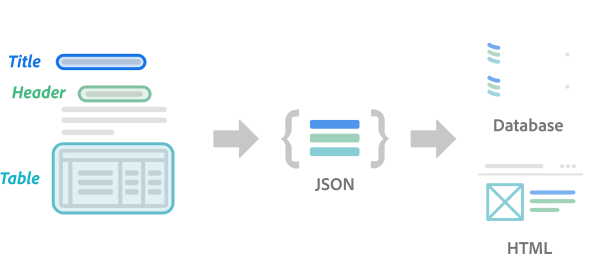

<TextBlock slots="heading, text, buttons" theme="lightest" className="padding-bottom-zero-child" />

## Adobe PDF extract API

A new web service that allows you to unlock content structure and table data from any PDF document with machine learning

* [Learn more](https://www.adobe.io/apis/documentcloud/dcsdk/pdf-extract.html)

<TextBlock slots="image, heading" theme="lightest" className="padding_top_align padding-zero imageHightAuto"/>

###

<TextBlock slots="text" width="33%" theme="lightest" className="align-left padding-top-zero" />

Leverage Adobe Sensei for a rich understanding of **content structure** with higher quality input to other systems

<TextBlock slots="text" width="33%" theme="lightest" className="align-left padding-top-zero" />

**Easily Extract content to JSON** format for further processing into other applications or databases

<TextBlock slots="text" width="33%" theme="lightest" className="align-left padding-top-zero" />

**Identify more document elements** than OCR with extraction of headings, paragraphs, lists, and more

