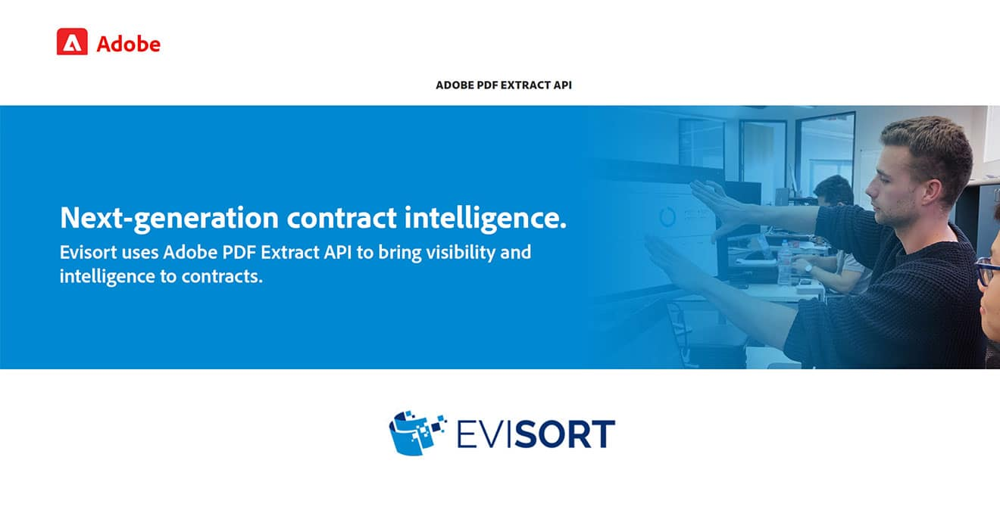

<TitleBlock slots="heading, text" theme="lightest" className="titleBlock-align-left" id="customer" />

### Customer stories

See how our customers are building great experiences and succeeding with Adobe.

<ResourceCard slots="link, image, heading,text" width="25%" theme="lightest"  className='useCaseCard card-heading-size' isCustomStories/>

[K2Nintext.pdf](K2Nintex.pdf)

### K2 NINTEX

Nintex transforms K2 Cloud workflows with Adobe Acrobat Services APIs.

<ResourceCard slots="link, image, heading, text " width="25%" theme="lightest" className='useCaseCard card-heading-size' isCustomStories/>

[AdobeInDesign.pdf](AdobeInDesign.pdf)

### ADOBE INDESIGN

Adobe InDesign brings its new Share for Review features to life with Adobe Acrobat Services APIs.

<ResourceCard slots="link, image, heading,text" width="25%" theme="lightest" className='useCaseCard card-heading-size' isCustomStories/>

[Cambridge-Assessment.pdf](Cambridge-Assessment.pdf)

### CAMBRIDGE ASSESSMENT

Cambridge Assessment intends to digitize more than 100 years of test material with Adobe PDF Extract API.

<ResourceCard slots="link, image, heading,text" width="25%" theme="lightest" className='useCaseCard card-heading-size' isCustomStories/>

[Evisort.pdf](Evisort.pdf)

### EVISORT

Evisort uses Adobe PDF Extract API to bring visibility and intelligence to contracts.

<ResourceCard slots="link, image, heading,text" width="25%" theme="lightest" className='useCaseCard card-heading-size' isCustomStories/>

[AI-Singapore-Story](AI-Singapore-Story.pdf)

### AI Singapore (AISG)

AI Singapore accelerates deep learning models with Adobe PDF Extract API.